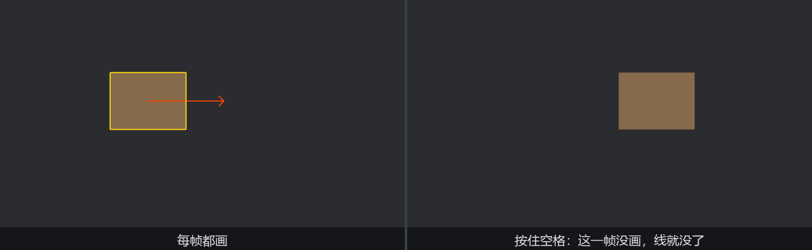
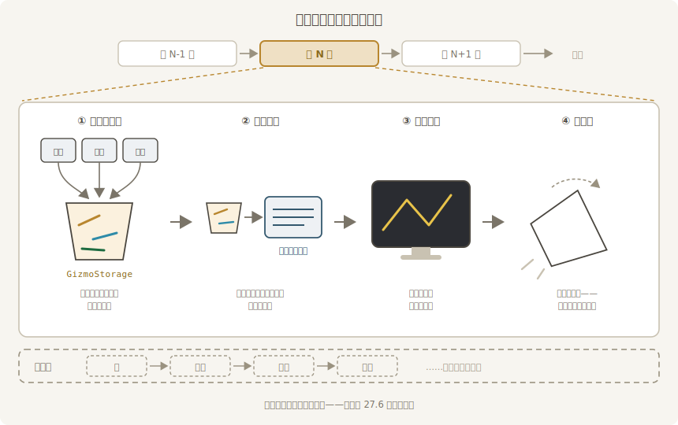

# 第一道粉线

先摆一个最小的场子：一只道具箱在台上来回滑，检场人要给它描个框、画一支速度箭头——不改箱子一根毛，全画在“台面”上。

## 道具箱上道

场子本身没有新东西：一个组件、一个 `Sprite`、一个来回横移的系统，全是第 15 章的旧手艺：

```rust
{{#include ../../code/ch27-dev-tools/examples/listing-27-01.rs:crate_type}}
```

新东西在 App 的装配和画线的系统里：

```rust
{{#include ../../code/ch27-dev-tools/examples/listing-27-01.rs:app}}
```

```rust
{{#include ../../code/ch27-dev-tools/examples/listing-27-01.rs:chalk}}
```

<span class="caption">Listing 27-1：第一道粉线——描框加箭头，每帧重画（examples/listing-27-01.rs）</span>

`chalk_marks` 的系统签名里站着本章第一位主角：**`Gizmos`**，一个系统参数——跟 `Commands`、`Query` 平起平坐，哪个系统想画线，把它写进参数列表就行，不需要任何实体或组件作载体。它从 `bevy::prelude` 直接可用，背后的 `GizmoPlugin` 早就随 `DefaultPlugins` 就位了。

两笔粉线各有讲究：

- `gizmos.rect_2d(center, CRATE_SIZE, GOLD)` 画一个线框矩形。第一个参数是**位形（isometry）**——位置加朝向的合称；这里只给了个 `Vec2`，它会自动升格成“平移到此处、不旋转”的位形（想旋转就传 `Isometry2d`，27.2 见）。第二个参数是完整的宽高（不是半宽），跟 `Sprite` 的尺寸同一口径，所以直接把 `CRATE_SIZE` 递过去，框就正好描在箱子边上。
- `gizmos.arrow_2d(起点, 终点, 颜色)` 画一支带尖的箭头。终点取 `center + Vec2::X * prop.speed * 0.5`——**半秒的路程**。箭头长短于是有了物理含义：越快越长，掉头时整支箭原地调转。拿真实量纲当长度，比随手拍一个“看着差不多”的常数有用得多——箭头一眼读出“半秒后它在哪”。

颜色参数处处都是 `impl Into<Color>`，所以第 15 章认识的调色板常量（`GOLD`、`ORANGE_RED`）直接塞进去就行。

跑起来：

```console
cargo run -p ch27-dev-tools --example listing-27-01
```

```text
检场：箱子上道。粉线伺候——按住空格我就歇手。
```



<span class="caption">Figure 27-1：金框与箭头贴着箱子走（左）；按住空格让画线系统歇手，粉线当场消失（右）</span>

## 即时模式：不画就没有

按住空格，粉线**当场消失**；松开，立刻回来。这就是 Listing 27-1 里那行 `run_if(not(input_pressed(KeyCode::Space)))` 安排的实验——空格按住期间，`chalk_marks` 被调度器跳过，这一帧没人喊 `rect_2d`，屏幕上就没有框。

这个行为叫**即时模式（immediate mode）**：每一帧，所有系统画的线攒进一个缓冲，帧末统一交给渲染器画出来，然后**缓冲清空**，下一帧从零开始。它和你熟悉的实体渲染是两种世界观——`Sprite` 是*保留*的：生成一次，之后每帧自动出现，直到你销毁它；粉线是*即抛*的：谁也不记得上一帧画过什么。



<span class="caption">Figure 27-2：即时模式的一帧——画、汇总、上屏、清空，循环往复</span>

初看浪费——一样的框每帧重画一遍？但对调试恰恰是**优点**：

- **零生命周期管理**。框不是实体，不用生成、不用销毁、不会泄漏。箱子被 despawn 的那一帧，查询里没有它，框自然就没了——不存在“忘了清理调试图形”这种事故；
- **画什么由数据现算**。每帧重画意味着每帧重新决定：速度变了箭头就变，想按条件画（血量低才描红框）就是一个 `if`。状态与画面永远同步，因为画面**就是**本帧状态的函数；
- **随写随扔**。排查一个 bug 时在任何系统里随手插一行 `gizmos.circle_2d(...)`，看完删掉，不留痕迹。

代价同样明摆着：几何数据每帧重传一遍 GPU。几十几百根线无所谓，几万根就是真开销了——那是 27.6 保留模式的地盘。

> 顺带一提：`Gizmos` 往公共桶里交货走的是和 `Commands` 同款的延迟机制（第 3 章的老熟人），所以多个系统可以**并行**各画各的，互不阻塞——调试层不会因为画得多而把游戏逻辑拖成单线程。

还有一个此刻看不出来、但值得先记下的细节：Listing 27-1 把 `chalk_marks` 排在 `slide_crate` **之后**（`.chain()`）。粉线画的是位置，位置刚被前一个系统改过——顺序反了，框就永远慢半拍、追着箱子跑。调试图形也是系统输出的一种，第 6 章的执行顺序纪律对它同样生效。

下一节把粉笔盒全倒出来：除了框和箭头，检场人还会画什么。
