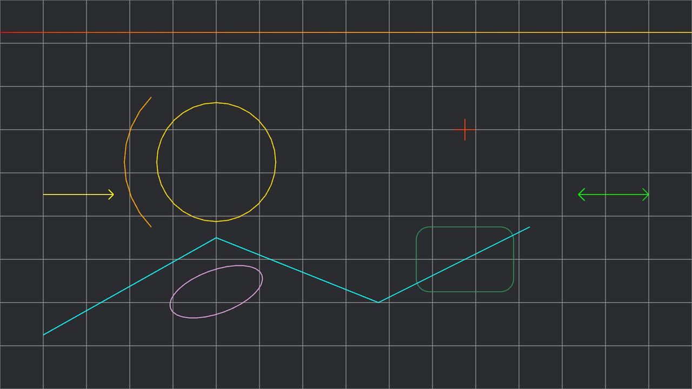
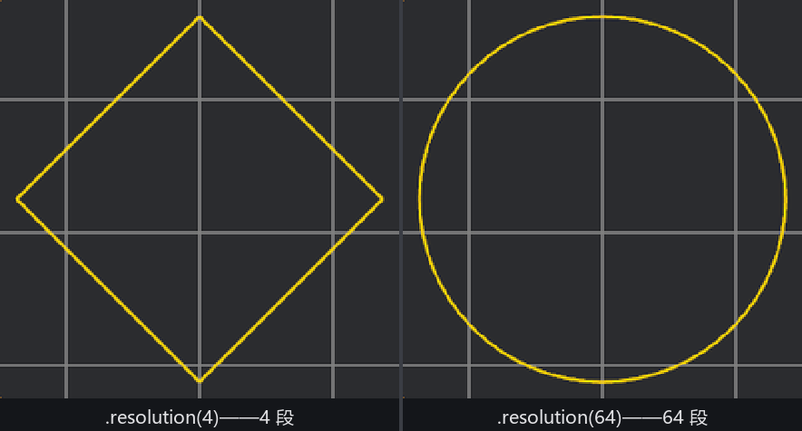

# 粉线字典

开演前的台面要画满记号：演员的站位、走位的路线、道具的落点、翻跟头的软垫范围。正好拿这一屏“台面记号”把 2D 粉线的词汇表过一遍——每样一行，全都长在 `Gizmos` 上。

```rust
{{#include ../../code/ch27-dev-tools/examples/listing-27-02.rs:floor_plan}}
```

<span class="caption">Listing 27-2（其一）：一屏画全 2D 词汇表（examples/listing-27-02.rs）</span>

```console
cargo run -p ch27-dev-tools --example listing-27-02
```



<span class="caption">Figure 27-3：开演前的台面记号——2D 粉线词汇一屏画全</span>

逐行过一遍，重点在参数：

- **`grid_2d(位形, 格数, 格尺寸, 颜色)`**——台面格线。格数是 `UVec2`（横竖各多少格）、格尺寸是每格的宽高；注意它返回的不是 `()`，而是一个 **builder**，链一个 `.outer_edges()` 把最外圈的边也描上（默认只画内部分隔线）。这种“先画、再链方法补细节”的手法是 gizmo API 的通用惯例，马上还会见到几次；
- **`circle_2d(位形, 半径, 颜色)`**——站位圈。链上的 `.resolution(n)` 指定这个“圆”用几段折线拼——对，**圆是折线拼的**，这正是接下来实验的主角；
- **`arc_2d(位形, 弧角, 半径, 颜色)`**——走位弧。这个 API 的参数约定值得站住看一眼：位形的**平移是圆心**，弧从位形的“正上方”（`Vec2::Y` 方向）起笔、**逆时针**扫过 `弧角`（弧度）；想让弧摆到别的方位，转动位形的旋转部分。Listing 里给了 `Isometry2d::new(圆心, Rot2::degrees(45.0))`——以站位圈为圆心、起笔方向拨过 45°，于是弧贴着站位圈外侧绕了四分之一圈，两环同心；
- **`rounded_rect_2d(位形, 尺寸, 颜色)`**——软垫框，链 `.corner_radius(24.0)` 拨圆角半径（还有个 `.arc_resolution()` 管每个圆角用几段折线，默认档就够滑）；
- **`cross_2d(位置, 半臂长, 颜色)`**——道具落点。一个叉两笔，参数里的长度是**半臂**：给 20.0，整个叉横竖各 40 像素；
- **`ellipse_2d(位形, 半轴, 颜色)`**——场记桌。半轴是 `Vec2`（横竖各自的半径）；这里位形给了真旋转 `Rot2::degrees(20.0)`，桌子斜着摆；
- **`arrow_2d(起点, 终点, 颜色)`**——上下场方向。默认单头；builder 链 `.with_double_end()` 变双头、`.with_tip_length(16.0)` 拨箭尖长度（像素）；
- **`line_gradient_2d(起点, 终点, 色1, 色2)`**——幕布沿线，一条线两头两色，中间插值。同族的还有 `linestrip_gradient_2d`，折线逐顶点配色；
- **`linestrip_2d(点序列, 颜色)`**——巡台路线，一笔连过所有点。姊妹 `lineloop_2d` 会自动把尾点接回头点，围出封闭圈。

一屏九样，但你不需要背——它们全按一个模板长：**位形/端点在前、尺寸参数居中、颜色收尾，特殊需求链 builder**。剩下没露面的同族（`ray_2d` 从起点画一段向量、`curve_2d` 沿曲线采样描线……）见了签名就会用。

## 拨一下：圆是几段折线

Listing 27-2 的另一半是个换挡系统——↑/↓ 在档位表里给站位圈换折线段数：

```rust
{{#include ../../code/ch27-dev-tools/examples/listing-27-02.rs:resolution_res}}
```

```rust
{{#include ../../code/ch27-dev-tools/examples/listing-27-02.rs:tune}}
```

<span class="caption">Listing 27-2（其二）：↑/↓ 拨站位圈的折线段数（examples/listing-27-02.rs）</span>

一路往下拨，终端报数，画面变脸：

```text
检场：站位圈改成 16 段折线。
检场：站位圈改成 8 段折线。
检场：站位圈改成 6 段折线。
检场：站位圈改成 4 段折线。
```



<span class="caption">Figure 27-4：`.resolution(4)` 的“圆”是一颗菱形（左）；64 段肉眼全滑（右）</span>

4 段的“圆”是一颗端端正正的**菱形**——因为 gizmo 的世界里只有线段，圆、弧、椭圆全是折线逼近。默认 32 段对屏幕上百来像素的圆足够；圆越大越要加段数，不然弧线会显出棱角。这个真相还解释了一件事：**为什么粉线永远是“线框”而不是实心面**——整套 API 的输出就只有线段（下一章的 UI 或第 15 章的 `Sprite` 才是画实心的正路）。

> 3D 的词汇表是同一套人马去掉 `_2d` 后缀：`line`、`linestrip`、`circle`、`arc_3d`、`grid_3d`、`cube`、`sphere`……参数从 `Vec2`/`Isometry2d` 换成 `Vec3`/`Isometry3d`，用法完全同构，27.7 的仓库场景里就会见到。另有两位 3D 专属选手值得点名：`gizmos.axes(transform, 长度)` 按惯例色（X 红、Y 绿、Z 蓝）画出一个 Transform 的三根轴，检查“这东西的朝向到底歪没歪”一行就够；`gizmos.primitive_2d`/`primitive_3d` 能直接把第 21 章的几何图元描成线框。

词汇有了，下一节调**笔**：线多粗、什么线型、拐角怎么处理。
