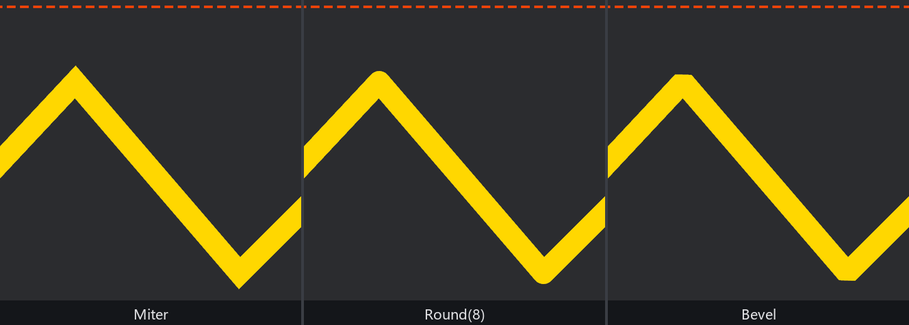
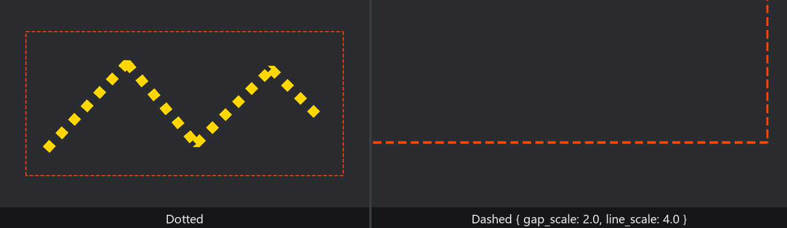

# 规格与分组

台面上的记号不归一个人管：走位线是检场画给演员的，安全线是舞台监督画给全班的。两拨线要各有各的规格——粗细不同、线型不同——更要紧的是**各有各的开关**：排走位时把安全线收起来，验台时把走位线收起来。

`Gizmos` 为此准备了专门的机制——**配置组（config group）**。到目前为止我们一直在往*默认组*里画（`Gizmos` 就是 `Gizmos<DefaultGizmoConfigGroup>` 的缩写）；现在自立门户：

```rust
{{#include ../../code/ch27-dev-tools/examples/listing-27-03.rs:groups}}
```

<span class="caption">Listing 27-3（其一）：两个自定义配置组，各自登记（examples/listing-27-03.rs）</span>

一个配置组就是一个空结构体加三个 derive：`Default` 和 `Reflect` 是 `GizmoConfigGroup` trait 的前置要求（配置存进类型擦除的容器里，靠反射找回来），`GizmoConfigGroup` 本身是个派生宏。**登记**那一步在 App 上：`init_gizmo_group::<WalkLines>()`——它为这个组开一套独立的顶点缓冲和一份独立的配置。别小看这行，本节末尾就看忘了它的下场。

## 先定规格：GizmoConfigStore

所有组的配置集中住在一个资源里——`GizmoConfigStore`。开台时先把两拨线的规格定好：

```rust
{{#include ../../code/ch27-dev-tools/examples/listing-27-03.rs:setup}}
```

<span class="caption">Listing 27-3（其二）：开台定规格——config_mut 按组取配置（examples/listing-27-03.rs）</span>

`config_store.config_mut::<WalkLines>()` 返回一对可变引用 `(&mut GizmoConfig, &mut WalkLines)`：前者是**每个组都有的公共配置**，后者是组结构体本身——你可以往自定义组里塞字段当扩展配置用（内置的 AABB 组就是这么干的，27.7 见），我们的两个组是空的，所以模式匹配里直接 `_` 丢掉。

`GizmoConfig` 一共四个字段，线的事都归 `line`（一个 `GizmoLineConfig`）：

- **`line.width`**——线宽，单位像素，默认 `2.0`。这里给走位线拨到 8.0：调试线在演示、录屏时经常嫌细，这是最常用的一个旋钮；
- **`line.style`**——线型 `GizmoLineStyle`：`Solid`（默认）／`Dotted` 点线／`Dashed { gap_scale, line_scale }` 虚线。虚线的两个参数以**线宽为单位**：`gap_scale: 2.0, line_scale: 4.0` 表示“空 2 倍线宽、画 4 倍线宽”，安全线于是成了一圈规整的长虚线——粗细变了虚实节奏也跟着缩放，不用重调；
- **`line.joints`**——折线拐角 `GizmoLineJoint`：`None`（默认，两段线各画各的，粗线时拐角处会裂开一个缺口）／`Miter` 尖角／`Round(n)` 圆角（n 是每个拐角补几个三角形）／`Bevel` 削平。走位线是急拐的之字，配 `Miter` 让拐点锋利成尖；
- **`enabled`**——本组总闸，`false` 时这组的所有绘制调用变成空操作；
- 还有两个先记名字的：`depth_bias`（3D 里把线往相机方向拉，治线框被模型面吃掉的闪烁，2D 无效）和 `render_layers`（第 13 章的渲染分层，控制哪台相机看得见这组线——比如“调试线只进编辑器相机、不进玩家相机”就靠它）。

`line` 里其实还有第四个字段 `perspective: bool`——3D 透视相机下让线宽随距离缩放（近粗远细），默认关。2D 场景无感，先按下不表。

## 画线的不管规格，管规格的不画线

两个绘制口径怎么区分？看系统参数的泛型：

```rust
{{#include ../../code/ch27-dev-tools/examples/listing-27-03.rs:draw}}
```

<span class="caption">Listing 27-3（其三）：`Gizmos<WalkLines>` 与 `Gizmos<SafetyLines>` 各画各的（examples/listing-27-03.rs）</span>

`Gizmos<WalkLines>` 画出来的线吃 `WalkLines` 组的规格，`Gizmos<SafetyLines>` 吃 `SafetyLines` 的——**API 一模一样，规格各归各**。同一个系统里两个参数并排要，也没有借用冲突（它们写的是不同的缓冲）。

换挡系统则只碰 `GizmoConfigStore`，一根线也不画：

```rust
{{#include ../../code/ch27-dev-tools/examples/listing-27-03.rs:tune}}
```

<span class="caption">Listing 27-3（其四）：运行时拨规格——线宽、线型、拐角、总闸（examples/listing-27-03.rs）</span>

跑起来拨一轮，终端逐条报账：

```console
cargo run -p ch27-dev-tools --example listing-27-03
```

```text
检场：走位线 8 像素带尖角，安全线虚线伺候。
检场：1/2 各关一组，左右方向键拨线宽，U 换线型，J 换拐角。
检场：拐角改 Round(8)。
检场：拐角改 Bevel。
检场：走位线改 Dotted。
检场：走位线全下。
检场：走位线回来了。
舞台监督：安全线摘了。
```



<span class="caption">Figure 27-5：粗线才看得出拐角的讲究——Miter 出尖、Round 圆过、Bevel 削平</span>



<span class="caption">Figure 27-6：线型两款——点线的“点”其实是方块（左）；虚线的节奏以线宽为单位（右）</span>

三个实验值得亲手拨：

1. **按住 → 加粗到 20 像素再按 J**。细线时四种拐角几乎无差别；粗线时 `None` 的拐角裂着缺口，`Miter` 的尖、`Round` 的圆、`Bevel` 的平一目了然（Figure 27-5）。这也是条经验：**调试线要粗，粗就得配拐角**；
2. **按 U 把走位线换成 `Dotted`**。整条之字变成一串方点（Figure 27-6 左）——点的尺寸就是线宽，间距也是线宽的函数；
3. **按 1**。走位线全下，安全线纹丝不动；再按 2，各自独立的开关互不越权——这正是分组的第一价值。等到收场的《检场》，F3 总闸拨的就是这些 `enabled`。

> 想在**登记时**顺手定规格（而不是像 Listing 27-3 这样在 `Startup` 里改），用 `App::insert_gizmo_config(组实例, GizmoConfig {...})` 一步到位；`GizmoConfigStore` 还有 `iter_mut()` 可以一把遍历所有组——官方 `3d_gizmos.rs` 示例就用它给所有组统一拨线宽。

## 忘了登记的下场

说好的下场来了。定义了组、系统里也要了 `Gizmos<GhostLines>`，唯独忘写 `init_gizmo_group`：

```rust
{{#include ../../code/ch27-dev-tools/examples/listing-27-04.rs:all}}
```

<span class="caption">Listing 27-4：幽灵组——少了一行登记（examples/listing-27-04.rs）</span>

编译一路绿灯（类型系统看不出“没登记”），窗口也开得出来——然后第一帧就翻脸，程序当场退场（退出码 101），报错逐字：

```text
thread 'Compute Task Pool (6)' (23596) panicked at C:\Users\94887\.cargo\registry\src\index.crates.io-1949cf8c6b5b557f\bevy_ecs-0.19.0\src\error\handler.rs:130:1:
Encountered an error in system `listing_27_04::chalk_ghost`: Parameter `Gizmos<'_, '_, GhostLines>` failed validation: Requested config listing_27_04::GhostLines does not exist in `GizmoConfigStore`! Did you forget to add it using `app.init_gizmo_group<T>()`?
If this is an expected state, wrap the parameter in `Option<T>` and handle `None` when it happens, or wrap the parameter in `If<T>` to skip the system when it happens.
```

这一嗓子响亮但讲理，值得逐层读：

- 出事的机制是**系统参数校验**——第 11 章见过它给 `Single` 兜底的样子。`Gizmos<GhostLines>` 取参时要去 `GizmoConfigStore` 领本组的配置，领不到，参数验不过；
- 验不过的默认处置是 panic（走 ECS 的默认错误处理器），第一行就点名肇事系统 `chalk_ghost`——我们一直开着的 `debug` feature 在这儿领工资；
- 第二段直接给修法：正主 `init_gizmo_group`，外加两个“如果这是预期状态”的软着陆选项——`Option<Gizmos<...>>`（领不到就 `None`，自己处理）或 `If<Gizmos<...>>`（领不到就跳过本系统）。软着陆真有用武之地：写一个第三方插件，想“宿主 App 登记了这个组我就画、没登记就闭嘴”，`Option` 版参数正是那个礼貌的写法。

跟 27.4 即将登场的“无声跳过”对照，这是失效谱系的另一端：**大喇叭**。忘登记响亮地死，比无声地不画幸运得多——你至少立刻知道自己错在哪。

规格讲完，该教粉笔写字了。
