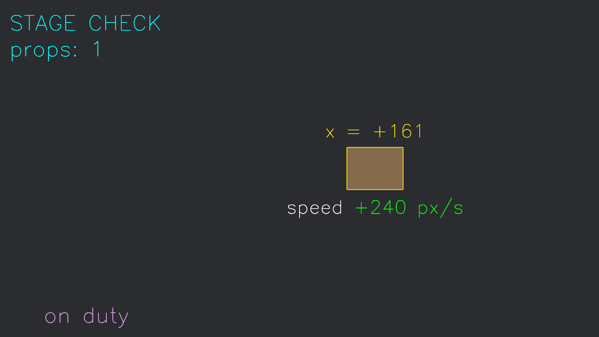

# 会写字的粉线

框和箭头能标出“在哪、往哪去”，标不出“是谁、值多少”。检场人削尖粉笔：`Gizmos` 还能直接**写字**——不用字体资产、不用 UI，一行调用把文字画在世界坐标里。

回到滑动的道具箱，这次给它挂两块活字牌，再在台口钉两块固定招牌：

```rust
{{#include ../../code/ch27-dev-tools/examples/listing-27-05.rs:labels}}
```

<span class="caption">Listing 27-5：文本 gizmo 四连——跟班坐标牌、双色速度牌、多行招牌、一次翻车（examples/listing-27-05.rs）</span>

```console
cargo run -p ch27-dev-tools --example listing-27-05
```



<span class="caption">Figure 27-7：描线字牌各就各位；左下角“检场 on duty”里的两个汉字成了空位</span>

## text_2d 的五个参数

`gizmos.text_2d(位形, 文字, 字号, 锚点, 颜色)`，逐个过：

- **位形**——文字放哪、转多少度。跟班坐标牌直接给箱顶坐标（`Vec2` 自动升格）；固定招牌给 `Isometry2d::from_translation`。想画斜的水印，转位形就行；
- **文字**——`&str`。因为是即时模式，**每帧现格式化一条新字符串毫无负担**：`format!("x = {:+.0}", center.x)` 让坐标牌成了活的——这正是文本 gizmo 相对正经文本的杀手锏：正经文本（第 16 章的 `Text2d`，或下一章的 UI `Text`）改内容要走字形排版与重布局，粉线字每帧从零画，天生就是给高频变化的调试数值准备的；
- **字号**——像素高（准确说是大写字母的帽线高）。字是折线画的，放大不糊，但也别指望印刷质感；
- **锚点**——`Vec2`，文字包围盒上的一个归一化定位点：`(0,0)` 盒中心对齐给定位置，`(-0.5,0.5)` 左上角对齐，`(0.5,-0.5)` 右下角对齐。跟班坐标牌用 `(0.0, -0.5)`——**下沿**居中对到给定点，牌子于是稳稳悬在箱顶上方；速度牌反过来用 `(0.0, 0.5)`，**上沿**对齐，吊在箱底下方。规律：锚点选哪边，文字就往反方向长——朝上挂的牌锚下沿，朝下吊的牌锚上沿，永不重叠；
- **颜色**——整段一色。

多行？字符串里直接 `\n`，左上角那块 `"STAGE CHECK\nprops: 1"` 就是两行。

分段配色则换姊妹 API **`text_sections_2d(位形, 段列表, 字号, 锚点)`**——颜色不再是最后一个参数，而是跟着每段文字走：`&[("speed ", 白), (数值, 绿或橙红)]`。速度牌的数值随方向换色，标签恒白，一块牌两种语气。

> 3D 同款：`text`／`text_sections`，位形换 `Isometry3d`。字会朝着位形的朝向立在世界里——给 3D 场景里的实体挂标签、在地面上写坐标，都是它。

## 哑巴坑：它只认 ASCII

左下角那块牌写的是 `"检场 on duty"`，画出来却只有 `on duty`，前头空了两个字符宽的位置——**两个汉字被无声地跳过了**（Figure 27-7 左下）。

文本 gizmo 用的是一套内嵌的**描线字体（stroke font）**：每个字形就是几笔折线，全部字库只覆盖 **ASCII 可打印区（32–126）**——大小写字母、数字、常用符号，共 95 个字形。范围之外的任何字符（汉字、假名、带音标的字母、emoji）都按一个空格的宽度跳过：**不报错、不警告、不画**。这是本章第一个哑巴坑，行为契约和第 26 章那些静默失效一脉相承——它不觉得这是错误，“画不了的字占个位”就是它的全部态度。

对策很简单：**调试标签用英文和数字**。真要在画面里写中文，那是第 16 章 `Text2d`／下一章 UI `Text` 的活，人家有正经字体资产。这个坑在本章收场还会回访一次——同样是往屏幕上写中文，换个场地（诊断小窗）照样翻车，只是翻车的姿势从“空位”换成“豆腐块”。

> 顺带把工作原理说破，你就记住这个坑了：`text_2d` 内部把每个字形的折线逐笔转成 `linestrip_2d` 调用——文字就是粉线，粉线只有线段。所以字号、颜色、`GizmoConfigStore` 的线宽线型对文字**全部生效**：把线宽拨粗，字就变成粗体；拨成 `Dotted`，字会碎成点阵。调试之余不妨一试。

写字的粉笔也备齐了。下一个问题藏在《打瓦》的正中央：游戏逻辑跑在 `FixedUpdate` 的鼓点上，粉线画在哪个时钟里？
