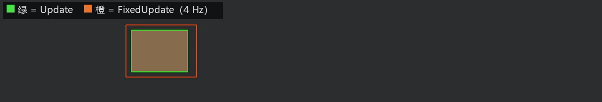

# 慢时钟下的粉线

第 18 章立过的规矩：物理和玩法走 `FixedUpdate` 的鼓点，渲染走 `Update` 的每帧。《打瓦》全按这个规矩办。那么问题来了——**检场的粉线该画在哪个时钟里？**

直觉的担忧是这样的：即时模式说“这一帧不画就没有”，而 `FixedUpdate` 在 60 帧的机器上以默认 64 Hz 的节奏跑，两边并不同步——有的渲染帧里固定时钟一拍都没跑，那画在 `FixedUpdate` 里的粉线，岂不是要一闪一闪地漏帧？

亲眼看一次。把固定时钟拨慢到肉眼能数的程度——每秒 4 拍——同一只箱子，两个时钟各描一框：

```rust
{{#include ../../code/ch27-dev-tools/examples/listing-27-06.rs:app}}
```

```rust
{{#include ../../code/ch27-dev-tools/examples/listing-27-06.rs:two_clocks}}
```

<span class="caption">Listing 27-6：绿框画在 Update，橙框画在 FixedUpdate，时钟拨到每秒 4 拍（examples/listing-27-06.rs）</span>

`Time::<Fixed>::from_hz(4.0)` 是第 18 章的旧旋钮；橙框故意画大一圈（`CRATE_SIZE * 1.25`），免得和绿框叠死。跑起来：

```console
cargo run -p ch27-dev-tools --example listing-27-06
```

```text
检场：固定时钟每秒 4 拍。绿框每帧描，橙框每拍描。
```



<span class="caption">Figure 27-8：绿框跟手，橙框一步一顿——但它在两拍之间**一直在**，不闪不灭</span>

## 驻留，而不是漏帧

实测结果分两半，各说各的事：

**橙框滞后、跳步**。它每 0.25 秒才画一次，画的是那一拍时箱子的位置；两拍之间箱子继续滑（`slide_crate` 在 `Update` 里每帧动），于是箱子会从橙框里“滑出去”。这一半是提醒：**粉线标的是画它那一刻的数据**——用哪个时钟的数据，就画在哪个时钟里，不然图形和逻辑对不上表。

**橙框不闪**。这一半才是本节的正题。按“每帧清空”的模型推演，四拍之间的几十个渲染帧里没人重画橙框，它应该消失才对——但它稳稳挂着。因为 `Gizmos` 的清空其实是**按上下文**的：

- 画在 `Update`（以及任何主调度里普通位置）的粉线，归**渲染帧上下文**：每个渲染帧清一次——27.1 讲的行为；
- 画在 `FixedUpdate`（整个 `FixedMain` 家族）的粉线，归**固定时钟上下文**：**每拍清一次**。这一拍画的线，会被引擎自动保管、逐帧重新提交给渲染器，直到下一拍开始才作废。

换句话说，`Gizmos` 对两种时钟各遵守各的“这一X不画就没有”：渲染帧的 X 是帧，固定时钟的 X 是拍。你不用写任何额外代码——同一个 `Gizmos` 参数，放进哪个调度就吃哪套清空规则。引擎内部靠一套上下文栈在 `RunFixedMainLoop` 前后交换缓冲来实现这一点，感兴趣可以去读 `bevy_gizmos` 的 `lib.rs`，不读也不影响使用。

> 引申一个实战细节：固定时钟上下文的“驻留”在**时钟停摆**时也成立。第 18 章讲过暂停虚拟时钟会让 `FixedUpdate` 整个停拍——此时最后一拍画的粉线会一直挂在屏幕上，正好用来定格检查。收场的《检场》就靠这一手：按 P 暂停，满场粉线原地立正，让你凑近慢慢看。

所以《打瓦》的调试层答案已经有了：玩法在 `FixedUpdate`，速度、碰撞这些数据也在 `FixedUpdate` 里新鲜，**调试粉线就画在 `FixedUpdate`，排在玩法系统之后**。既标对数据，又由引擎代管驻留。

把时钟的事办妥了，回头解决 27.1 留下的性能悬念：几千根不变的线，真要每帧重画吗？
