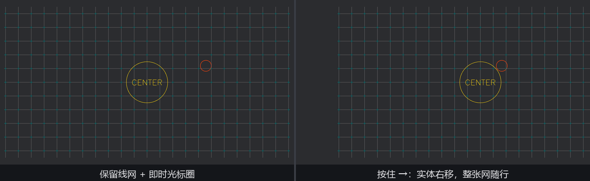

# 一劳永逸的粉线

后台的地面上有一整张**定位线网**：几十根纵横基准线、两百多个交叉点小叉、台心一个招牌圈。这张网一旦画好就再不变动——按即时模式的路子，每帧几百个绘制调用、几千个顶点重新攒一遍再传给 GPU，纯属白干。`bevy_gizmos` 为这种“画一次、用到散场”的场面准备了**保留模式（retained mode）**：把线画进一份**资产**，挂在实体上。

```rust
{{#include ../../code/ch27-dev-tools/examples/listing-27-07.rs:build}}
```

<span class="caption">Listing 27-7（其一）：把整张定位线网画进 GizmoAsset，用 Gizmo 组件挂上实体（examples/listing-27-07.rs）</span>

三步走：

1. **`GizmoAsset::new()`** 造一份空资产。它的绘制 API 和 `Gizmos` **一模一样**——`line_2d`、`cross_2d`、`circle_2d`、连 `text_2d` 都在（27.4 的描线字照写）——因为两者底下是同一个缓冲类型，只是这次线攒进资产而不是每帧即抛的桶里。循环画完 34 根基准线、253 个小叉、一个 48 段的圈和一行 `CENTER`，这份活只干这一次；
2. **`gizmo_assets.add(locator)`** 存进 `Assets<GizmoAsset>` 换一枚 `Handle`——第 14 章的资产流程，只不过这份资产不是从磁盘加载的，是现场手搓的（和第 21 章手搓 `Mesh` 同一个感觉）；
3. **挂 `Gizmo` 组件**生成实体。三个字段：`handle` 指向资产；`line_config` 是**逐实体**的线规格（就是 27.3 认识的 `GizmoLineConfig`——注意保留模式不走 `GizmoConfigStore` 的分组配置，规格随组件走）；`depth_bias` 同名同义，2D 无效。

交货前那几行是清点：`GizmoAsset` 能用 `.buffer()` 借出只读视图，`list_positions`（独立线段的端点表）和 `strip_positions`（折线顶点表）的长度就是这张网的真实规模。跑起来验收：

```console
cargo run -p ch27-dev-tools --example listing-27-07
```

```text
检场：定位线网一次搭好——独立线段 540 根、折线顶点 125 个，再不重画。方向键整体挪。
```

540 根线段加 125 个折线顶点，从此**一个字节都不再重传**——顶点数据在 GPU 上安家，每帧只是照常绘制。官方文档对两种模式的分工说得很直白：大量静态线条，`Gizmo` 组件的性能远胜 `Gizmos` 系统参数；少量高频变化的线，还是即时模式顺手。

## 挂在实体上，就有实体的待遇

保留粉线是正经实体，实体的全套待遇它都有。Listing 27-7 的另外两个系统演示了最有用的两样：

```rust
{{#include ../../code/ch27-dev-tools/examples/listing-27-07.rs:coexist}}
```

<span class="caption">Listing 27-7（其二）：即时光标圈与保留线网同台；方向键平移线网实体（examples/listing-27-07.rs）</span>

- **吃 `Transform`**。`Gizmo` 组件的 required components 里带着 `Transform`（第 3 章的机制），资产里的坐标全是这个实体的**局部坐标**——挪动实体，整张网跟着走。方向键平移的就是实体，540 根线一根没重画；
- **与即时模式同台**。`chalk_live_cursor` 用第 17 章的 `cursor_position()` 加第 13 章的 `viewport_to_world_2d` 把鼠标位置换算进世界，画一个跟手的橙圈——即时归即时、保留归保留，两边互不干扰。



<span class="caption">Figure 27-9：保留线网与即时光标圈同台（左）；方向键平移实体，整张网随行（右）</span>

其余待遇照推：`despawn()` 连根收走；同一份 `Handle` 可以挂给多个实体，一张网版复用出好几份，各自摆各自的位置——资产与实体的老规矩都适用。但有一条**不适用**，值得点破：保留粉线不走可见性体系——渲染侧提取它的查询里只认 `Gizmo + GlobalTransform`（加可选的 `RenderLayers`），压根不看 `Visibility`，挂 `Visibility::Hidden` 毫无反应。想临时藏起一张网，摘掉 `Gizmo` 组件（`remove::<Gizmo>()`）或者干脆 despawn——这毕竟是调试图形，引擎没为它配齐正规军的全部编制。

> **系统之外也能画**。还有个冷门但救急的入口：全局函数 `gizmo()`（就在 `bevy::prelude` 里）。它返回一个全局缓冲的锁柄，绘制 API 还是同一套——专治“这段代码不在系统里、拿不到 `Gizmos` 参数”的场合（自由函数、trait 实现的深处）。画进去的线走默认组、每帧清空，跟即时模式一个待遇。知道有这么扇后门就行，正路还是系统参数。

到此为止画的都是“自己动手”的粉线。下一节看引擎批发的成品：包围盒和灯形，一行组件的事。
