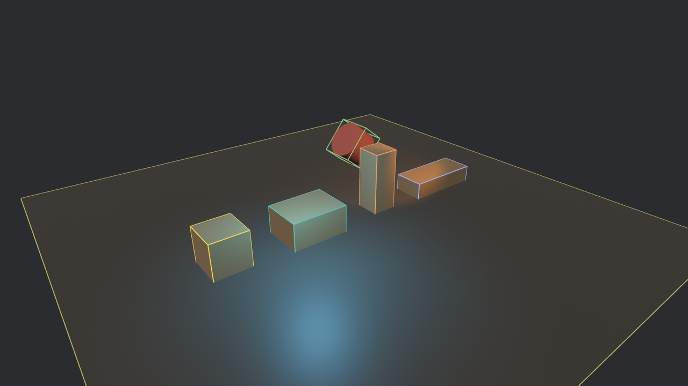
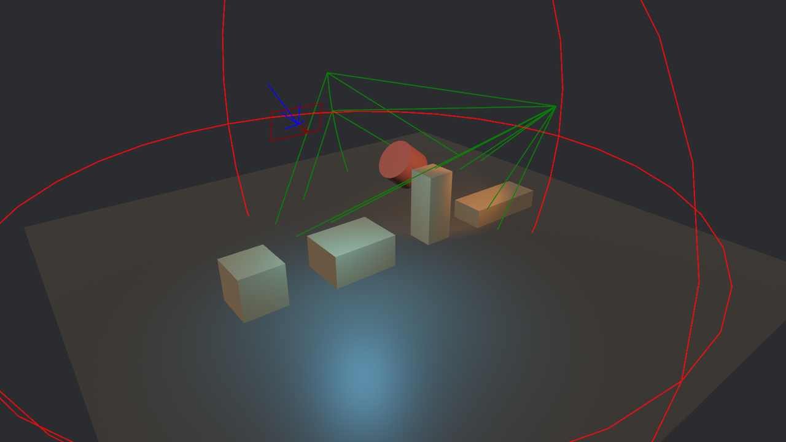

# 现成的描边

有几样东西是所有 3D 项目迟早都要描的：**包围盒**（这东西的碰撞/剔除边界到底在哪）和**灯**（光源本体不可见，range 和朝向全靠猜）。这两样引擎已经批发好了——不用自己写画线系统，挂个组件、拨个开关的事。

场子换到后台仓库：一块地面、四只尺寸各异的道具箱、一只斜躺的堂鼓（圆柱，第 21 章的图元），再把第 22 章的四种灯各请一盏——点光、聚光、平行光、矩形光：

```rust
{{#include ../../code/ch27-dev-tools/examples/listing-27-08.rs:setup}}
```

<span class="caption">Listing 27-8（其一）：后台仓库——四箱一鼓四盏灯（examples/listing-27-08.rs）</span>

四个开关全在一个系统里：

```rust
{{#include ../../code/ch27-dev-tools/examples/listing-27-08.rs:toggles}}
```

<span class="caption">Listing 27-8（其二）：B/A 拨包围盒，L/C 拨灯形（examples/listing-27-08.rs）</span>

```console
cargo run -p ch27-dev-tools --example listing-27-08
```

## 包围盒：ShowAabbGizmo 与 draw_all

每个带网格的实体身上都躺着一个自动算好的 **`Aabb`** 组件——包围盒（axis-aligned bounding box）。第 13 章认识的视锥在做剔除时，对的账就是这只盒：盒子整个落在视锥外，实体就不必送去渲染。它平时全程隐形，想亲眼看看，两条路：

- **逐实体**：给谁挂 `ShowAabbGizmo`，就描谁。组件有一个字段 `color: Option<Color>`——`Some` 指定颜色，`None` 走组默认。B 键给主箱挂上金色的框，再按摘掉，`insert`/`remove` 的老手艺；
- **全场**：`AabbGizmoConfigGroup` 的 `draw_all` 一拨，**所有**带 `Aabb` 的实体统统描框，挂没挂组件都算。注意取配置的手法——`config_store.config_mut::<AabbGizmoConfigGroup>()`：这是个**内置的配置组**，27.3 说过自定义组结构体可以带扩展字段，引擎这里就是示范——`draw_all` 和 `default_color` 都是组结构体上的字段，跟着 `GizmoConfig` 一起住在 `GizmoConfigStore` 里。

```text
检场：主箱描上金框。
检场：全场描框，一件不落。
```



<span class="caption">Figure 27-10：`draw_all` 一件不落——斜躺堂鼓的盒子跟着躺（轴对齐是对它自己的本地轴说的），地面是一只扁盒</span>

Figure 27-10 里藏着两处值得指认的细节：

- **没指定颜色的实体各领一色**。这些颜色不是随机数——引擎用 `color_from_entity(entity)` 把实体索引喂给一个色相散布函数（Oklch 色彩空间里按黄金角跳色），保证相邻实体颜色相互远离且**每次运行一致**。你自己的调试绘制也可以直接调用这个函数，“一实体一色”是描边类调试的通用刚需；
- **斜躺的堂鼓，盒子跟着躺**。“轴对齐”对齐的是**网格自己的本地轴**：`Aabb` 组件存的是本地空间里的紧身盒，描边时经实体的 `GlobalTransform` 画出来，斜躺的鼓自然套着斜躺的盒。剔除拿的也是这只盒连同变换（`Frustum::intersects_obb` 的账），所以画面上这只斜盒就是剔除眼里的真实边界——不是先入为主想的那种“永远正立、把斜物罩得松松垮垮的世界轴大盒”。

> 同族还有一位 `ShowFrustumGizmo`——挂在**相机**上描视锥（第 13 章的那只锥台原形毕露），多相机排查“为什么那台相机看不见这东西”时是利器，用法与 AABB 完全同构。骨骼网格的包围盒 gizmo 则等第 30 章动画再会。

## 灯形：ShowLightGizmo

灯是隐形的实体：画面上只有它照出来的效果，没有它自己。`ShowLightGizmo` 给灯画“形”——不同灯种画法不同，一眼分辨：

```text
检场：灯形牌翻了个面。
检场：灯形配色改 ByLightType。
```



<span class="caption">Figure 27-11：四种灯形各有画法——球圈标 range，锥线标 outer_angle，箭头标朝向</span>

看图读参数：点光的**球圈半径就是 `range`**（照多远一目了然，22 章拨过的那个字段第一次有了形状）；聚光的**锥角就是 `outer_angle`**；矩形光的框就是 `width × height`，箭头指发光面的朝向；平行光没有位置意义，画成一支方向箭头。

配色策略归 `LightGizmoConfigGroup`（又一个带扩展字段的内置组，`bevy_light` 注册的），C 键轮换它的 `color` 字段，四档 `LightGizmoColor`：

- **`MatchLightColor`**（默认）——灯形用灯自己的颜色，所见即所设；
- **`ByLightType`**——按灯种上色：点红、聚绿、平行蓝、矩形褐（四色各有字段可改），场里灯多时按“种类”找灯用这档；
- **`Varied`**——实体散布色（就是上面那个 `color_from_entity`），按“个体”找灯用这档；
- **`Manual(Color)`**——统一指定一色。

它同样有 `draw_all`；Listing 27-8 没用它，而是 L 键循环给每盏灯 `insert`/`remove` 组件——两条路殊途同归，逐实体给了你“只看这一盏”的粒度。

引擎批发的描边到此看完。记两条通用规律收尾：**其一**，这类调试可视化的标准形态都是“逐实体 marker 组件 + 配置组里的 draw_all”，以后遇到新的（物理引擎的碰撞体描边、导航网格的三角化……第三方 crate 也普遍学这个样式）直接按这个模式找开关；**其二**，它们底下就是本章前几节的 `Gizmos`——`AabbGizmoPlugin` 的源码不过是“查询所有 `Aabb`，逐个 `gizmos.aabb_3d(...)`”的一个系统（画进自己的 `AabbGizmoConfigGroup` 组），你已经具备徒手重写它的全部知识。

粉笔的家当至此全部亮完。接下来换人登场：场记抱着账本来了。
