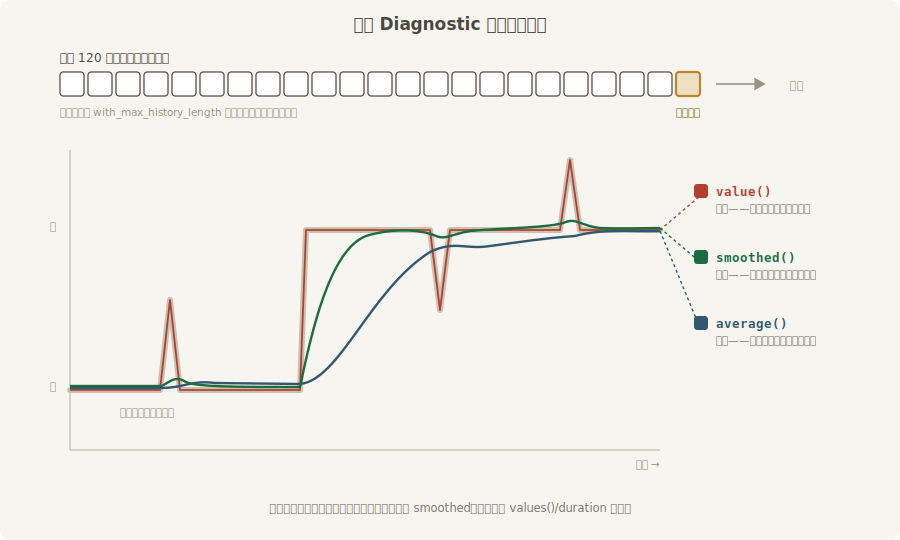

# 场记的账本

粉线管“看形”，很多问题却是“看数”：帧率掉没掉？实体涨没涨？内存吃了多少？这类问题的答案是一串随时间变化的数值——把它们记下来、算个均值、定期念出来，就是 `bevy_diagnostic` 这个 crate 的全部工作。它是场记的账本。

其实你早就见过它的字迹。本书每个用 `DefaultPlugins` 的例子启动时，终端开头都有这么一行：

```text
INFO bevy_diagnostic::system_information_diagnostics_plugin::internal: SystemInfo { os: "Windows 11 Home China", kernel: "26200", cpu: "13th Gen Intel(R) Core(TM) i7-13700H", core_count: "14", memory: "31.6 GiB" }
```

这是诊断家族的 `SystemInfo` 资源在打招呼——机器的底细（系统、内核、CPU、核数、内存）开机自报，随 `DefaultPlugins` 就有。但**账本机制的大部队不在默认阵容里**：核心设施（`DiagnosticsPlugin`，提供账本仓库）在，一本本具体的账和念账的人要自己请。

## 三本账加一位播报员

```rust
{{#include ../../code/ch27-dev-tools/examples/listing-27-09.rs:app}}
```

<span class="caption">Listing 27-9（其一）：三本内置账 + 每秒念账的播报员（examples/listing-27-09.rs）</span>

四个插件各司其职：

- **`FrameTimeDiagnosticsPlugin`**——帧账，一口气立三本：`fps`（每秒帧数）、`frame_time`（帧耗时，毫秒）、`frame_count`（开机以来总帧数）。`default()` 之外还有 `new(max_history_length)` 可以定制史册长度（下文就讲这是什么）；
- **`EntityCountDiagnosticsPlugin`**——口数账 `entity_count`：世界里现存多少实体；
- **`SystemInformationDiagnosticsPlugin`**——机器账四本：`system/cpu_usage`、`system/mem_usage`（全机 CPU/内存占用率）和 `process/cpu_usage`、`process/mem_usage`（本进程的——其中内存这本记的不是百分比而是绝对量，念出来带 GiB 后缀）。采样是真开销，所以它在后台任务池里慢慢测（第 34 章的 `AsyncComputeTaskPool`），数值不逐帧新鲜；另有一条脾气：**开了 `dynamic_linking` 时它罢工**——动态链接与 sysinfo 不兼容，附录 A 用它加速编译的读者请留意；
- **`LogDiagnosticsPlugin`**——播报员，本身不记账，只是**每隔一秒把在册的账全念一遍**到终端。

跑起来，一秒后账本开念：

```console
cargo run -p ch27-dev-tools --example listing-27-09
```

```text
INFO bevy_diagnostic: system/cpu_usage  :    9.708038%  (avg 17.815387%)
INFO bevy_diagnostic: frame_time        :   16.487383ms (avg 20.176512ms)
INFO bevy_diagnostic: process/cpu_usage :    3.571429%  (avg 5.038486%)
INFO bevy_diagnostic: entity_count      :  382.000000   (avg 381.862745)
INFO bevy_diagnostic: system/mem_usage  :   56.183906%  (avg 56.113628%)
INFO bevy_diagnostic: fps               :   60.652437   (avg 89.596617)
INFO bevy_diagnostic: frame_count       : 50.000000
INFO bevy_diagnostic: started_load_count:  119.000000   (avg 118.078431)
INFO bevy_diagnostic: process/mem_usage :    0.431000GiB (avg 0.402908GiB)
```

（时间戳列从略。）这一屏的信息密度不小，逐条盘：

- **格式是 `名目: 当前值 (avg 均值)`**，名目列宽自动对齐到最长的那个。`ms`、`%`、`GiB` 这些单位后缀是每本账自带的；
- **`fps` 约 60**——垂直同步在锁帧，本机显示器 60 Hz。旁边的 `avg 89` 是开机头几帧的虚高（窗口刚开时零负载狂奔）被拉进了均值，跑几秒就沉回 60 附近——这一对数值的差异正好引出下面“三种读数”的话题；
- **`entity_count: 382`**——台上明明只有一只箱子加一台相机！这不是 bug：第 11 章说过，这个世界里**系统是实体、观察者是实体、资源也住在实体上**，382 口人绝大多数是引擎的官差。这本账的价值在**相对变化**：生成一堆东西忘了收，它一路爬升，一眼便知；
- **`frame_count: 50` 后面没有 `(avg …)`**——总帧数是单调计数，求均值没有意义，这本账在登记时就把史册长度设成了 0，播报员对没有历史的账只念当前值。细节虽小，说明格式不是死的，账本的“体质”决定念法；
- **`started_load_count: 119`——一本我们没立过的账**。它是资产系统自己记的（`AssetServer` 立的“启动过多少次加载”），随 `DefaultPlugins` 就在册。这暴露了一个重要事实：**账本是公共设施，引擎各子系统也在用**；播报员念的是*在册的一切账*，不只是你请的那几本。

## 一本账的三种读数

一本 `Diagnostic` 不是一个数，是**一段历史**：最近 N 次测量（默认 N=120）连时间戳存成队列。读它有三个口径：

- **`value()`**——最新一笔。最敏捷，也最神经质；
- **`average()`**——滑动窗口均值：最近 120 笔的算术平均。最稳，但一次尖刺会在窗口里赖 120 帧，反应慢半拍；
- **`smoothed()`**——指数滑动均值（EMA）：新测量按时间间隔加权混入旧值，响应快于 `average` 又滤掉了逐帧抖动。**播报员念的“当前值”其实就是它**——所以上面 `fps` 那列不是原始测量，是平滑后的读数。



<span class="caption">Figure 27-12：一本账、三种读数——敏捷、平稳、折中</span>

这套设计对帧率这种高频抖动的量身定做：盯瞬时值会被噪声骗，盯长均值会错过突变，EMA 是工程上的折中。下一节自己立账时三种读数都会用上。

## 播报口径：过滤与节奏

播报员可以现场调教——它的状态住在 `LogDiagnosticsState` 资源里：

```rust
{{#include ../../code/ch27-dev-tools/examples/listing-27-09.rs:tune}}
```

<span class="caption">Listing 27-9（其二）：F 只念 fps，G 恢复全念，T 改播报节奏（examples/listing-27-09.rs）</span>

按 F 之后，播报立刻瘦身成一行——注意连名目列宽都跟着收窄了（对齐宽度按“要念的账”现算）：

```text
INFO bevy_diagnostic: fps:   60.080628   (avg 60.091630)
INFO bevy_diagnostic: fps:   60.638211   (avg 60.120583)
```

过滤是一张名单：`enable_filtering()` 立一张空名单（谁都不念），`add_filter`/`extend_filter` 往名单里添名目，`remove_filter` 划掉，`disable_filtering()` 撤销名单回到全念。名单也可以在请插件时就带上——`LogDiagnosticsPlugin::filtered(名单)`。T 键的 `set_timer_duration` 则拨播报间隔，0.25 秒一轮时终端明显变密。这几个旋钮在排查特定问题时是刚需：全念太吵，一行行盯着才看得清趋势。

> `LogDiagnosticsPlugin` 还有个 `debug: true` 构造模式，改念每本账的 `Debug` 全貌（整段历史都倒出来），日常用不上，知道有就行。

账本念给终端看毕竟糙了些。27.10 会把它挂上屏幕小窗；在那之前，先学会自己立账。
