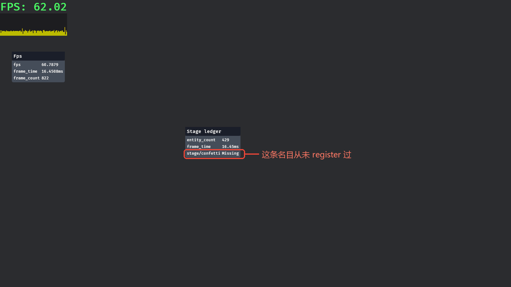

# 开发工具箱

粉线要自己画，账要自己念——有没有现成的？有。`bevy_dev_tools` 是官方的开发工具箱：FPS 水牌、可拖拽的诊断小窗、状态换场播报员，全是“请个插件就上岗”的成品。但它跟前两个 crate 有个根本区别：**它不在默认 feature 集合里**。

## 一扇要自己开的门

先看没开门的下场。假设你在一个普通的 Bevy 项目里（默认 feature）写下：

```rust
{{#include ../../code/ch27-dev-tools/no-compile/listing-27-11.rs}}
```

<span class="caption">Listing 27-11：没开 feature 就 use bevy::dev_tools——此文件在 no-compile/ 下，不参与构建（no-compile/listing-27-11.rs）</span>

编译器一口回绝（本章 crate 用 `--no-default-features` 复现，报错逐字）：

```text
error[E0433]: cannot find `dev_tools` in `bevy`
 --> ch27-dev-tools\examples\listing-27-11.rs:6:11
  |
6 | use bevy::dev_tools::fps_overlay::FpsOverlayPlugin;
  |           ^^^^^^^^^ could not find `dev_tools` in `bevy`
```

E0433 干脆利落：`bevy` 门面下根本没有 `dev_tools` 这个模块——feature 没开，整个 crate 就没被编进来。这和第 25 章相机控制器那扇门是同一种门，开法也一样：在 `Cargo.toml` 里给 bevy 依赖点名 `features = ["bevy_dev_tools"]`（本章 crate 的完整写法见 27.0 引过的那份 `Cargo.toml`）。

官方其实备了个更顺手的**开发期集合**：`dev` feature 一开三样——`bevy_dev_tools`（本节主角）、`debug`（报错带系统名，第 4 章起我们一直单独开着）、`file_watcher`（资产热重载，第 14 章的老朋友）。它的定位写在官方注释里，转述过来就是：*开发期打开改善体验，发布的构建别带*。这正是检场人的合同——上台干活，不上戏单。本章 crate 的做法（见 27.0 的 `Cargo.toml`）是把 `bevy_dev_tools` 转发成自己的默认 feature，日常全绿，报错实验用 `--no-default-features` 一键复现。

> 怎么让“发布不带”自动化？惯用法是给自己的调试插件包一层 `#[cfg(feature = "dev")]`（自己项目的 feature 再转发 bevy 的），`cargo build --release --no-default-features` 时整层调试皮连编译都不参与。收场的《检场》会把整层调试收进一个插件，正是为了让这一刀好切。

## FPS 水牌与诊断小窗

门开了，请两位成品上台。场子沿用滑箱子，另备一垛 200 只的备用箱（空格搬进搬出，给口数账制造起伏）和一个双态小状态机（`Backstage`：歇场↔彩排，R 键切换）：

```rust
{{#include ../../code/ch27-dev-tools/examples/listing-27-12.rs:app}}
```

<span class="caption">Listing 27-12（其一）：水牌、小窗管家、口数账、换场播报员一次请齐（examples/listing-27-12.rs）</span>

**`FpsOverlayPlugin`** 在屏幕左上角挂一块 FPS 水牌，全部配置打包在 `FpsOverlayConfig` 里：

- `text_config: TextFont`——字体配置（这里只拨字号 28；`TextFont` 是第 16 章的老类型，UI 文本的正式讲解在下一章）；
- `text_color`——字色；
- `refresh_interval`——数字多久刷一次，默认 100 毫秒。别拨太密：低于 50 毫秒它会警告你“刷新本身也是开销”；
- `enabled`——总闸；
- `frame_time_graph_config`——水牌下面那条**帧时图**：滚动的柱状条，每帧一根，`target_fps`（60，高于它柱子发绿）与 `min_fps`（30，低于它发红）划出黄绿红三段目测区。帧率数字看均值，帧时图看**分布**——偶发的卡顿尖刺在数字里被平滑掉，在图上是一根扎眼的红柱。

它会自动补挂 `FrameTimeDiagnosticsPlugin`（水牌的数据源就是那本 `fps` 账——整套水牌是账本机制的下游），还把自己顶到几乎最高的 UI 层级（`GlobalZIndex(i32::MAX - 32)`，留了 32 层给你想压过它的东西）。

**`DiagnosticsOverlayPlugin`** 则是小窗管家：请了它之后，**生成一个带 `DiagnosticsOverlay` 组件的实体就是开一扇小窗**：

```rust
{{#include ../../code/ch27-dev-tools/examples/listing-27-12.rs:windows}}
```

<span class="caption">Listing 27-12（其二）：两扇小窗——预设的 fps 窗与自订的台账窗（examples/listing-27-12.rs）</span>

`DiagnosticsOverlay` 两个字段：`title` 窗标题，`items` 一列 `DiagnosticsOverlayItem`。每个条目三件事——`path` 指名目、`statistic` 挑读数口径（`Value`／`Average`／`Smoothed`，27.8 的三种读数在这里成了菜单）、`precision` 小数位。图省事有两条捷径：`DiagnosticsOverlay::fps()` 预设窗一行开张；`路径.into()` 把裸 `DiagnosticPath` 升格成“Smoothed、4 位小数”的默认条目。

跑起来（`cargo run -p ch27-dev-tools --example listing-27-12`），左上角热闹了：



<span class="caption">Figure 27-13：水牌、帧时图与两扇小窗；台账窗里那行 **Missing** 是故意的</span>

三处行为值得点名：

- **小窗是活的**：拖标题栏挪窗，单击标题栏折叠/展开，按到哪扇哪扇置顶——这些交互全是管家用第 25 章的指针事件（`Pointer<Drag>`、`Pointer<Click>`）搭的，UI 拾取默认在场，零配置；
- **两扇窗出生在同一个角落**（左上 32 像素处），叠成一摞——这是当前的出厂行为，自己拖开摆桌面即可。它们的位置就是 UI `Node` 的 `top`/`left`，程序想代劳也就是改两个字段的事（《检场》里会这么干）；
- **`stage/confetti` 那行读作 `Missing`**——这个名目本例从没 `register` 过。跟 27.4 的哑巴坑对照着看：同样是“要的东西不存在”，文本 gizmo 选择无声跳过，小窗选择**明写 Missing**。后者是更友善的失效方式——它把“忘了立账/忘了挂插件”从静默 bug 变成一眼可见的提示。

剩下的键各拨一轮收个尾。空格把两百只备用箱搬进后台，台账窗的 `entity_count` 应声从 429 跳到 629，再按一次搬走、数字落回——口数账的用法就是盯这种起伏。C/4/5 三个键拨的全是 `FpsOverlayConfig`：换字色、收水牌、收帧时图，改的只是资源的字段，牌面立刻跟上——插件内部用 `resource_changed`（第 5 章的资源变更检测）盯着这份资源，谁改它谁触发重刷，你不用喊任何“刷新”函数。

## 状态换场播报员

Listing 27-12 里还有一个不起眼但极其实用的小工具——`log_transitions`：

```rust
{{#include ../../code/ch27-dev-tools/examples/listing-27-12.rs:states}}
```

它不是插件，是一个**现成的泛型系统**：`add_systems(Update, log_transitions::<Backstage>)`，从此这个状态机的每次换场都有案可查。按两下 R：

```text
INFO bevy_dev_tools::states: listing_27_12::Backstage transition: None => Some(Resting)
INFO bevy_dev_tools::states: listing_27_12::Backstage transition: Some(Resting) => Some(Rehearsing)
INFO bevy_dev_tools::states: listing_27_12::Backstage transition: Some(Rehearsing) => Some(Resting)
```

第一行的 `None => Some(Resting)` 是开机进默认态的那次“换场”——第 10 章讲过状态机的启动转换，这里它自己招了。调试“菜单怎么没回来”“暂停怎么进了两次”这类状态谜案，先挂它，转换史一目了然。

> 工具箱里还有几件本章不展开的散件，报个名号：`EasyScreenshotPlugin`（一键截图存盘）、`DebugPickingPlugin`（拾取事件的日志与浮层，配 `DebugPickingMode` 资源三档拨，第 25 章的疑难杂症归它）、`schedule_data`（导出调度结构数据，feature 另开）。还有一位**已经在场**的：`bevy_dev_tools` 和 3D 同开时，`RenderDebugOverlayPlugin` 会自动进 `DefaultPlugins`，把 **F1/F2 两个键全局征用**（轮换渲染缓冲的检修画面）。它眼下还嫩——本书环境里实测画不出正确的底片——但**键位征用是真的**：你的 dev 构建里 F1/F2 已经名花有主，自家键位请绕行。《检场》的总闸选 F3/F4，就是让的这个道。

工具箱盘点完毕。还差一件大家伙：编辑器手感的搬运把手。
