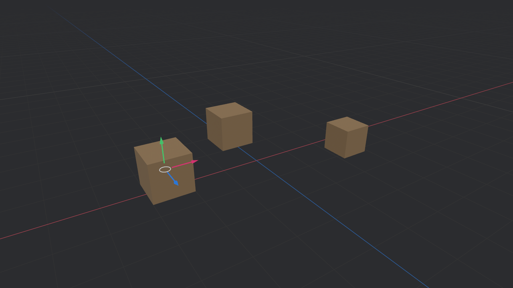
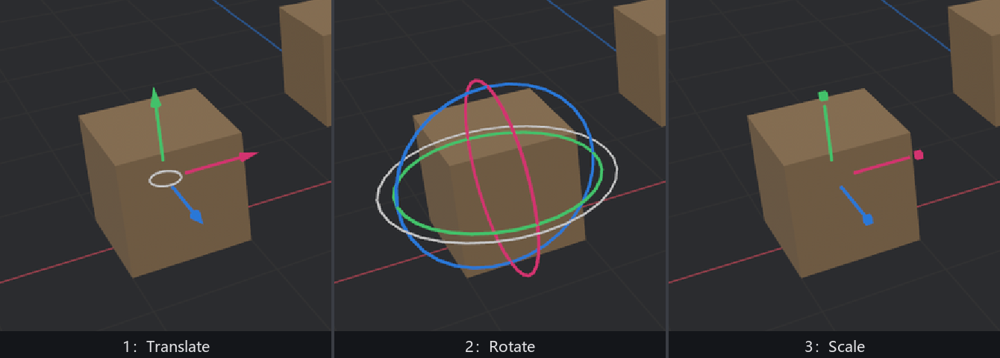

# 迷你检修间

调道具摆位的老流程是：改代码里的坐标 → 重新编译 → 看一眼 → 再改。要是能像编辑器那样**伸手进画面里拖**，一轮迭代从分钟缩到秒。这一节就搭这么个迷你检修间，两件套：`bevy_dev_tools` 的**无限网格**打底，`bevy_gizmos` 的 **Transform Gizmo** 当把手，再借第 25 章的拾取当点选。

```rust
{{#include ../../code/ch27-dev-tools/examples/listing-27-13.rs:app}}
```

```rust
{{#include ../../code/ch27-dev-tools/examples/listing-27-13.rs:setup}}
```

<span class="caption">Listing 27-13（其一）：无限网格 + 三只箱子 + 把手插件（examples/listing-27-13.rs）</span>

```console
cargo run -p ch27-dev-tools --example listing-27-13
```



<span class="caption">Figure 27-14：无限网格打底，0 号箱挂上搬运把手</span>

## 无限网格

`InfiniteGridPlugin` 请进来后，**生成一个 `InfiniteGrid` 实体**就有了一张铺满世界的地面网格——编辑器味道的那种：X 轴描红、Z 轴描蓝、每十根一条粗线，向远处淡出。它不是真无限，淡出距离相对相机计算，所以走到哪铺到哪。

配置在 `InfiniteGridSettings` 组件上（放网格实体上，或者放**相机**上——后者在多相机时让每台相机看到不同风格的网格）：四种线色（`x_axis_color`／`z_axis_color`／`minor_line_color`／`major_line_color`）、`fadeout_distance`（淡出距离，本例从默认 100 收到 60，画面更干净）、`dot_fadeout_strength`（顺着视线方向的额外淡出强度）、`scale`（格距缩放，值越小格越稀）。

它和 27.2 的 `grid_2d`/`grid_3d` 什么关系？粉线网格是**有限的、逐帧画的调试记号**；无限网格是**一整套独立渲染管线**做的地面（真的往 `Transparent3d` 相位里插了自定义绘制，第 37 章的领域），当基准地面用，两者不争活。

## 搬运把手

`TransformGizmoPlugin` 是 `bevy_gizmos` 出品但**不随 `DefaultPlugins`**，手动请。分工立得很清楚：

- **交互逻辑**归这个插件：悬停检测、拖拽数学、吸格；
- **画把手**的渲染插件随 `DefaultPlugins` 自动就位（把手是真网格，不是粉线——所以看起来有立体感）；
- **键盘不归它管**：换模式、换轴系全靠你自己拨 `TransformGizmoSettings`，它一个键都不监听——这是刻意的，编辑器的快捷键布局各家各异，它不越权。

指挥它靠两顶“帽子”（marker 组件）和一个设置资源：

- **`TransformGizmoFocus`**——扣在**要操纵的实体**头上，谁戴帽子把手就长在谁身上。同时只该有一顶：官方文档说多了取第一个，实际更糟——悬停检测的参数里是个 `Single`，两顶帽子直接让它校验失败、整只把手歇工。点选换焦点时记得先摘旧帽（下面的观察者就是这么写的）；
- **`TransformGizmoCamera`**——扣在**相机**头上。单相机场景可以不戴（它自动用唯一那台）；多相机必须指认，不然它宁可罢工也不瞎猜；
- **`TransformGizmoSettings`**——资源，模式、轴系、吸格全在这。

点选换焦点是第 25 章拾取的三行活——`MeshPickingPlugin` 加一个观察者，摘旧帽扣新帽：

```rust
{{#include ../../code/ch27-dev-tools/examples/listing-27-13.rs:interact}}
```

<span class="caption">Listing 27-13（其二）：点谁修谁 + 键盘拨设置（examples/listing-27-13.rs）</span>

上手拖一把：悬停到品红的 X 箭头附近（判定半径 `axis_hit_distance`，默认 35 屏幕像素，不用瞄得太准），按住左键沿轴拖——箱子**只沿 X 轴**滑动，把手随行；拖绿色 Y 箭头只上下走，白色圆圈则贴着视平面四向自由拖。松手即定。



<span class="caption">Figure 27-15：1/2/3 三种把手——搬运的箭头、旋转的环、缩放的方块杆</span>

`TransformGizmoSettings` 逐字段过：

- **`mode: TransformGizmoMode`**——`Translate`／`Rotate`／`Scale` 三模式，把手形状随之变脸（Figure 27-15）：搬运是箭头，旋转是三个正交圆环（外加一个绕视轴的白环），缩放是方块杆。数字键拨它纯粹是我们自己的键位约定；
- **`space: TransformGizmoSpace`**——轴系：`World` 世界轴（把手永远正着摆）还是 `Local` 本地轴（把手跟着实体自己的旋转歪）。X 键切换；转过的箱子上两种轴系差别立现。有一条内置例外：**缩放永远走本地轴**——沿世界轴缩一个斜着的物体在数学上就不是“缩放”了（会切变），它替你挡了这个坑；
- **`snap_translate` / `snap_rotate` / `snap_scale`**——三个 `Option<f32>` 吸格档：`None` 丝滑，`Some(步长)` 逐格跳。G 键给搬运上 0.5 米格、旋转上 15°格（弧度值，`15.0_f32.to_radians()`），拖起来手感立变“咔哒咔哒”——对齐摆放的神器；
- **`axis_length`／`rotate_ring_radius`／`axis_hit_distance`**——把手的臂长、环半径、悬停判定半径，默认值顺手，一般不动；
- **`screen_scale_factor`**——把手的**恒定屏幕尺寸**系数（默认 0.1）：相机拉远，把手在世界里等比放大，屏幕上看着永远一边大。设 0 关闭，把手变成世界里的固定尺寸物件；
- **`confine_cursor`**——拖拽期间把系统光标圈在窗口内（默认开），防止拖到窗外丢焦点。

想只在“编辑模式”下让把手活着？它的所有系统都在 `TransformGizmoSystems` 这个 system set 里（`PostUpdate`），一行 `configure_sets` 挂 `run_if` 就能整套门控——第 6 章的调度手艺处处通用。

> 运行时状态在 `TransformGizmoState` 资源里可以只读旁观：`hovered_axis` 悬着哪根轴、`active` 是否正在拖、`entity` 拖的是谁——想给把手加音效、加高亮 UI，读它就够，不用自己重算拾取。

检修间到此齐装。三样工具（粉线、账本、工具箱）各自练熟了，最后一节合龙——把它们整编成一个可以一刀摘除的检场插件，装回《打瓦》。
