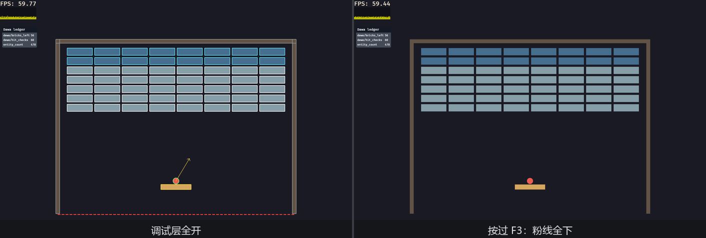
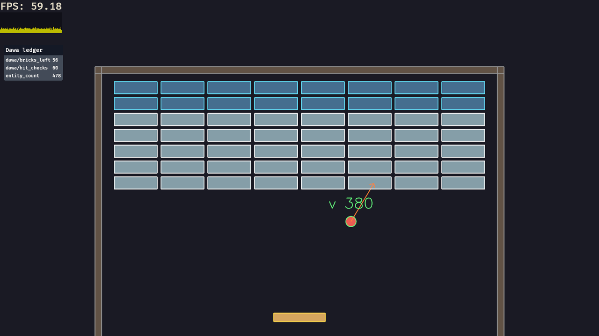

# 收场：《检场》

兑现第 26 章末尾的承诺：给《打瓦》配一位检场人。玩法内核从第 20 章原样搬回——court、凳、球、瓦阵、`FixedUpdate` 鼓点上的圆撞盒，一个字段没改——剥掉菜单、锣鼓、记分（工作台不需要观众席），腾出的地方叠一整层调试皮：

- 粉线：所有登记在册的碰撞盒描框，球画碰撞圆、速度箭头、`v 380` 描线速度牌，沟线用虚线画出来（它在台沿之下，玩家从来看不见，检场看得见）；
- 账本：`dawa/bricks_left`（台上还剩几片瓦）、`dawa/hit_checks`（每拍做了多少对碰撞检查）两本自家账，连同口数账挂进屏幕小窗；
- 水牌：FPS 加帧时图；
- 播报：`log_transitions` 盯着定格状态机；
- 键位：←/→ 移凳、空格发球、**P 定格**、**F3 粉线总闸**、**F4 水牌开关**。

```console
cargo run -p ch27-dev-tools
```

```text
老雷：工作台开张。检场，你的粉线伺候着。
检场：得嘞——F3 粉线，F4 水牌，P 定格慢慢看。
```



<span class="caption">Figure 27-16：检场在场（左）与粉线全下（右）——F3 一键，游戏画面纹丝不动</span>

## 一个插件管全部

架构上只有一个新主张，但它是本章真正的收束：**整层调试皮住在一个插件里**。`main()` 里它只占一行：

```rust
{{#include ../../code/ch27-dev-tools/src/main.rs:main}}
```

<span class="caption">Listing 27-14（其一）：调试层在装配清单上只是一行（src/main.rs）</span>

插件本体开在同文件的一个内联模块里（`mod chalk`），它**只“看”游戏，从不改玩法的任何数据**——读组件、数数、画线、挂窗，全是旁观者动作：

```rust
{{#include ../../code/ch27-dev-tools/src/main.rs:chalk_plugin}}
```

<span class="caption">Listing 27-14（其二）：ChalkPlugin——水牌、小窗、两本账、一组虚线配置，一站配齐（src/main.rs）</span>

几处集成细节，全是前文伏笔的兑现：

- **粉线排进 `FixedUpdate`，在玩法之后**——`(chalk_court, chalk_ball, keep_ledger).after(PlaySet)`。27.5 定的规矩：数据在哪个时钟里新鲜，粉线就画在哪个时钟里；`PlaySet` 是给玩法链定义的 system set，`.after` 保证描的是本拍刚算完的位置；
- **沟线独立成组**（`GutterLine`，虚线、3 像素），别家粉线走默认组——27.3 的分组在实战里的样子：不同语义的调试线各持配置，总闸时两组一起拨；
- **两本账后缀故意不写中文**——27.9 埋的雷在这里排掉：账本小窗用引擎内置字模，`" 片"` 上屏就是豆腐块（27.4 的 ASCII 脾气换个场地再犯），乖乖用裸数字；
- **小窗出生位挪了一手**——`PostStartup` 里把它的 `Node.top/left` 从默认的左上角（会和水牌叠住）搬到水牌下方。27.10 说过小窗位置就是两个字段。

画线的两个系统本身没有新面孔，全是 27.1–27.4 的手艺派上实战——值得看的是**按语义配色**（凳金、釉瓦亮青、素瓦白、墙灰）和**待发球画预告箭头**（半透明——粉线颜色带 alpha 就是半透明）这两个小心思：

```rust
{{#include ../../code/ch27-dev-tools/src/main.rs:chalk_marks}}
```

<span class="caption">Listing 27-14（其三）：描台、描球、记账——调试层的全部“业务”（src/main.rs）</span>

`keep_ledger` 里那本 `hit_checks` 账顺便当了一次**算术自检**：它记“球数 × 在册盒子数”，开局 1 球 ×（56 瓦 + 3 墙 + 1 凳）= 60；击碎一片瓦，小窗立刻变 59——账目对得上，说明碰撞系统面对的世界跟你以为的一致。调试数值的价值往往不在数字本身，在**它和你的心算对不上的那一刻**。

总闸就是拨配置与资源，27.3 与 27.10 各出一半：

```rust
{{#include ../../code/ch27-dev-tools/src/main.rs:switch}}
```

<span class="caption">Listing 27-14（其四）：F3 拨两组粉线的 enabled，F4 拨水牌的 config（src/main.rs）</span>

## 定格验台：P 键的检修流

真正让这层皮好用的是**定格**。P 键的实现是第 20 章的原样：拨状态、捏住虚拟时钟：

```rust
{{#include ../../code/ch27-dev-tools/src/main.rs:pause}}
```

<span class="caption">Listing 27-14（其五）：定格——虚拟时钟一停，FixedUpdate 整个停拍（src/main.rs）</span>

按下 P 的瞬间，球钉在半空——**而满场粉线原地立正，一根不灭**。这正是 27.5 那条引申的兑现：粉线画在 `FixedUpdate`，归固定时钟上下文管，“下一拍才作废”；时钟停了，下一拍永远不来，最后一拍的粉线就一直挂着。于是检修流成立：看到可疑的弹跳 → P 定格 → 凑近读框读箭头读账 → P 放行。要是当初把粉线画在 `Update` 里，这套流程照样能用（每帧重画嘛），但画的将是“暂停后仍在空转的系统所见”，而不是“出事那一拍的定影”——两种语义，`FixedUpdate` 这版才是验尸报告。

`log_transitions` 在旁边记录每次定格（stderr 逐字）：

```text
INFO bevy_dev_tools::states: ch27_dev_tools::Flow transition: None => Some(Running)
INFO bevy_dev_tools::states: ch27_dev_tools::Flow transition: Some(Running) => Some(Paused)
INFO bevy_dev_tools::states: ch27_dev_tools::Flow transition: Some(Paused) => Some(Running)
```



<span class="caption">Figure 27-17：P 定格——球钉在半空，粉线与账目全员立正，随你端详</span>

最后一道验收：把 `main()` 里 `add_plugins(chalk::ChalkPlugin)` 那行**删掉**，重新编译——游戏一切照旧，只是台上再没有检场的痕迹。整层调试皮一刀下来干干净净，这就是“检场不上戏单”的工程含义。要更进一步，就照 27.10 的做法把这行包进 `#[cfg(feature = "dev")]`，让发布构建从编译期就不认识他。

## 小结

这一章给你配齐了一位检场人的全部家当：

- **粉线（`bevy_gizmos`）**：`Gizmos` 系统参数即画即抛——每帧重画是特性不是浪费，状态与画面天然同步；词汇表一个模板（位形、尺寸、颜色、builder 补参），文字也是粉线（ASCII 限定）；规格与开关按组管理（`GizmoConfigStore` + 自定义 `GizmoConfigGroup`），忘登记组是响亮的 panic；画在哪个时钟就按哪个时钟清（`FixedUpdate` 的粉线驻留到下一拍，暂停时驻留到天荒地老）；大批静态线走保留模式（`GizmoAsset` + `Gizmo` 组件）；包围盒、灯形有现成描边，样式都是“marker 组件 + draw_all”；
- **账本（`bevy_diagnostic`）**：一本账是一段带时间戳的历史，三种读数各有脾气（value 敏捷、average 平稳、smoothed 折中）；内置四家账本插件按需请，播报员每秒念账、名单可过滤；自家的账三步立起（const 名目 → register → 闭包记账），懒求值让贵测量按需付费；
- **工具箱（`bevy_dev_tools`）**：一扇要自己开的 feature 门（`dev` 集合，发布别带）；FPS 水牌 + 帧时图、可拖拽小窗（未注册的账明写 Missing）、状态换场播报员、无限网格；F1/F2 已被渲染检修浮层征用；
- **搬运把手（Transform Gizmo）**：两顶帽子指认目标与相机，一个设置资源管模式/轴系/吸格，配第 25 章的拾取就是一个迷你编辑器；
- **架构**：调试层=一个只读插件，粉线跟玩法的时钟走，一行可摘除，一层 `cfg` 可绝育。

下一部分转向 UI：第 28 章从 `Node` 与布局开始，把本章一直“只用不讲”的那套屏幕元素（水牌、小窗、状态牌背后的东西）正式摆上台面。

## 练习

1. **弹道预言家**：给《检场》的球再画一条**预测轨迹**——从球心沿速度方向画一条线，撞到第一面墙的位置画个 `cross_2d`（提示：逐段步进检测，或者直接解“射线与三面墙的交点”取最近者；全部画在 `FixedUpdate`）；
2. **第四种读数**：`Diagnostic` 有 `values()` 迭代整段历史。写一个系统，每秒对 `dawa/hit_checks` 的历史算一次**最大值**并 `info!` 出来——帧时图的“看分布”思想，用账本 API 自己做一遍；
3. **检修间进《检场》**：把 27.11 的两顶帽子搬进《检场》：`MeshPickingPlugin` 换成 `SpritePickingPlugin`（第 25 章），点选一片瓦给它挂 `TransformGizmoFocus`……然后你会发现把手不出现——因为把手的渲染走 3D 管线，而《打瓦》是 2D 场景。退而求其次：用 `Pointer<Click>` 观察者加一段 gizmo 高亮描边，做一个纯 2D 的“点谁描谁”。这个练习的真正收获是搞清楚**哪些调试工具是维度中立的**（粉线、账本、小窗，以及 AABB 描边——2D 精灵也有自动算好的 `Aabb`，挂上 `ShowAabbGizmo` 照样描框，本书作者替你验证过了），哪些不是（把手要 3D 渲染管线，无限网格走 3D 透明相位）；
4. **绝育演习**：给本章 crate 加一个自己的 `dev` feature，把 `ChalkPlugin` 的注册包进 `#[cfg(feature = "dev")]`，验证 `cargo run -p ch27-dev-tools --no-default-features` 时……编译不过——因为 `use bevy::dev_tools` 还在文件顶端。把 `mod chalk` 整个也包进 `cfg`，让检场人从编译单元里彻底消失。
