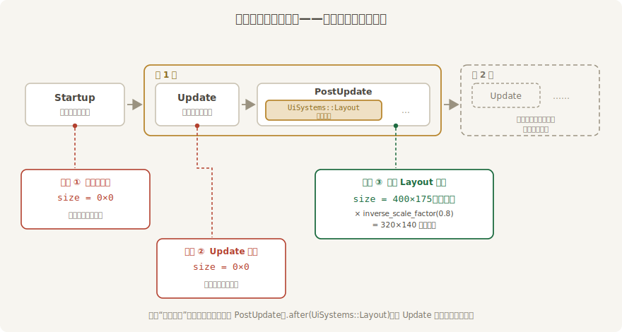

# 量尺的什么时候来

上一节的牌子写的是 320×140，屏幕上它真占了多少？`Node` 里的是**意图**，结算结果记在另一本账上——required components 全家福里的 **`ComputedNode`**。它是布局系统每帧写好的实测账本：`size()` 报尺寸，还有内容区、边框、缩放系数等一批读数，后面陆续用到。

但这本账不是随时可读的。什么时候记账、什么时候来查，时机不对就会看到一账本的零。安排三个系统，在一帧的三个位置量同一块牌：

```rust
{{#include ../../code/ch28-ui-layout/examples/listing-28-02.rs:measure}}
```

<span class="caption">Listing 28-2：三个时机量同一块牌——Startup、Update、布局之后（examples/listing-28-02.rs）</span>

三处量法只差在调度：

- **`measure_at_startup`** 排在 `Startup` 里 `setup` 之后（`.chain()` 保证顺序）——spawn 完立刻量；
- **`measure_in_update`** 排在 `Update`——游戏逻辑住的地方，用 `Local<u32>` 只报前两帧；
- **`measure_after_layout`** 排在 `PostUpdate`，并且 `.after(UiSystems::Layout)`。`UiSystems` 是 `bevy_ui` 的 system set 名录（从 `bevy::ui::UiSystems` 引入），`Layout` 这一档就是布局结算本算——第 6 章的排序手艺，指哪排哪。

```console
cargo run -p ch28-ui-layout --example listing-28-02
```

```text
开台（Startup）量一次：size = Vec2(0.0, 0.0)
第 1 帧 Update 量一次：size = Vec2(0.0, 0.0)
第 1 帧布局之后量一次：size = Vec2(400.0, 175.0)（物理像素）
  乘 inverse_scale_factor(0.8) 换回逻辑像素 = Vec2(320.0, 140.0)
第 2 帧 Update 量一次：size = Vec2(400.0, 175.0)
```

五行输出，两件事值得掰开。

## 布局系统住在帧尾

前两行都是零。**布局系统 `ui_layout_system` 住在 `PostUpdate`**——跟第 12 章的 transform 传播是邻居，道理也相同：`Update` 里游戏逻辑随便改意图（改字段、挂节点、摘节点），改几次都行；帧尾 `PostUpdate` 统一结算一次，不做无用功。于是：



<span class="caption">Figure 28-2：布局在一帧里的位置——`Update` 在结算之前，读到的永远是上一帧的账</span>

- `Startup` 是开台仪式，布局一次都还没跑——账本全零；
- 第 1 帧的 `Update` 也在当帧结算**之前**——还是零；
- 排在 `UiSystems::Layout` 之后的系统，同一帧内就能读到刚出炉的数；
- 从第 2 帧起，`Update` 里读到的是**上一帧**的结算——晚一拍，但对绝大多数用途（读个尺寸做逻辑判断）无伤大雅。

实践里记一条就够：**需要“本帧最新”布局数据的系统，放 `PostUpdate` 排在 `UiSystems::Layout` 之后；在 `Update` 里读，拿到的是上一帧的数，且开场第一帧是零**。忘了这条的典型症状，是开场逻辑拿零尺寸做除法或定位，界面第一帧闪烁跳位——难查，因为第二帧起一切正常。

## 账本记的是物理像素

第三行报 400×175，可牌子明明写的 320×140——没记错账，是**单位不同**。`ComputedNode` 里存的一律是**物理像素**：本机显示器开着 125% 缩放，一个逻辑像素占 1.25 个物理像素，320×1.25 = 400。这样渲染端拿账本直接落笔，不再折算。

换算回逻辑像素用账本自带的 **`inverse_scale_factor()`**——缩放系数的倒数，本机 1/1.25 = 0.8，乘上去就回到 320×140。本章后面所有报数系统都走这一乘，跟 `Node` 里写的意图对得上眼。你的显示器若是 100% 缩放，两套数字会恰好相同——别被“在我机器上不用乘”骗了，交付到别人的高分屏上就现形。

牌子有了，账也会读了。可眼下尺寸全是写死的像素——拖一下窗口，牌子无动于衷。下一节把 `Val` 的全部量法请出来阅兵。
