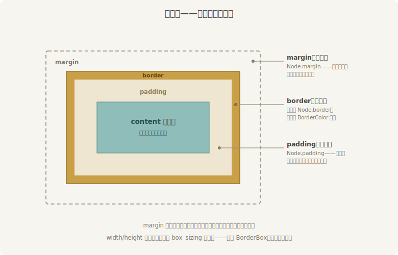
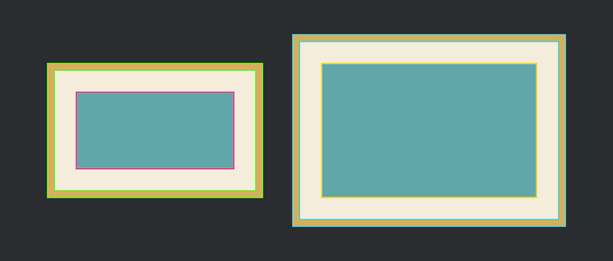

# 三层皮

到目前为止的牌子都是光板：一块色，到边为止。实际的界面元素讲究得多——字不能顶着板边写，牌与牌不能挤成一团，考究的还要描一圈金边。布局系统为此把每个节点从里到外分成四层，这套分法叫**盒模型**（box model），跟 CSS 一脉相承：



<span class="caption">Figure 28-4：盒模型四层皮——内容、内衬、边框、外距，各归 `Node` 的一个字段管</span>

- **content（内容区）**——子节点和文字实际住的地方；
- **`padding`（内衬）**——内容区与边框之间的衬垫，算自家地皮；
- **`border`（边框）**——一圈有厚度的框。注意厚度是布局的事，写在 `Node` 里；颜色才归 `BorderColor` 组件管；
- **`margin`（外距）**——自家与邻居之间让出的空地，**不算**自家尺寸。

`padding`、`border`、`margin` 的类型都是 **`UiRect`**——四个 `Val` 一组，`left`、`right`、`top`、`bottom` 各管一边。四边同值用 `UiRect::all(px(8))`，横竖各一值用 `UiRect::axes(横, 竖)`，只管一横或一竖用 `UiRect::horizontal(...)` / `UiRect::vertical(...)`，逐边单填也行。

有一个立刻冒出来的问题：`width: px(240)` 的 240，量的是哪层皮的宽？管这件事的字段叫 **`box_sizing`**。两块牌子，图纸完全相同，只有这一个字段不同：

```rust
{{#include ../../code/ch28-ui-layout/examples/listing-28-04.rs:board}}
```

<span class="caption">Listing 28-4：同一张图纸两种量法——240×150、padding 24、border 8、margin 16，只差 `box_sizing`（examples/listing-28-04.rs）</span>

牌子内部塞了一块 `percent(100)` 见方的青布当内容物——它会撑满**内容区**，把 padding 留出的衬边显出来。`BorderColor::all(...)` 是边框色的四边同值写法；它跟 `BackgroundColor` 一样是独立组件，而且四条边可以各配各的颜色（描金上框、朱漆下框也办得到，这儿用不上）。

```console
cargo run -p ch28-ui-layout --example listing-28-04
```

按空格报数：

```text
  BorderBox（默认）：实测 240 × 150 逻辑像素
  ContentBox：实测 304 × 214 逻辑像素
```

同一张图纸，量出两个尺寸，差值正好是两层皮：

- **`BoxSizing::BorderBox`（默认）**：240×150 量到**边框外沿**——整块牌子（连衬带框）就这么大，内容区被 padding 和 border 往里挤，只剩 240 − 24×2 − 8×2 = 176 宽。“我要一块 240 宽的牌子”，所见即所得；
- **`BoxSizing::ContentBox`**：240×150 量的是**内容区**——青布保住了 240×150，衬和框往外加，整牌撑到 240 + 48 + 16 = 304 宽。“我要给一块 240 宽的内容留位置”，外皮另算。

写过 CSS 的读者注意：网页的历史默认是 content-box，Bevy 反过来把更直觉的 **BorderBox 定为默认**——毕竟布局时人心里想的多半是“这块东西占多大地方”。

margin 的 16 像素在哪？不在报数里——两块牌的实测尺寸都没含它，它变成了牌与牌之间的那条缝：两家各让 16 像素，互不相挨。顺带记一条给写过 CSS 的读者：Flexbox 里相邻外距**不折叠**，两个 16 就是实打实的两个 16。

## 拨一下：开盏透视镜

数字对上了，眼见为实更好。`bevy_ui` 备了一盏调试透视镜，能把每个节点的三层框直接描在画面上。它锁在 **`bevy_ui_debug`** 这个 cargo feature 门后（不在默认集合里，本章 crate 已把它做成默认 feature 转发），开关是资源 **`GlobalUiDebugOptions`**——注意它的门面在 `bevy::ui_render`，不在 `bevy::ui`：

```rust
{{#include ../../code/ch28-ui-layout/examples/listing-28-04.rs:xray}}
```

<span class="caption">Listing 28-4（续）：F3 拨透视镜——三层框各有一个开关（examples/listing-28-04.rs）</span>

`outline_border_box`（默认开）、`outline_padding_box`、`outline_content_box` 三个开关各描一层框；这儿三层全开。按 F3：



<span class="caption">Figure 28-5：透视镜下的两块牌——三层框把 padding 和 border 的地界描得明明白白，右牌整体大出两层皮</span>

这盏镜子本章后面随叫随到——布局不对劲时，先 F3 看看每块地皮的实际边界，比对着代码猜快得多。资源里还有 `line_width`、`show_hidden`（把隐藏节点也描出来）、每节点覆盖用的 `UiDebugOptions` 组件等细项，用到再查。

> 若你自己的项目忘了开 `bevy_ui_debug` feature，`use bevy::ui_render::GlobalUiDebugOptions` 会直接吃一个 E0432“未找到”编译错——这扇门跟第 27 章 `bevy_dev_tools` 是同款门禁，开门方式也一样（`bevy = { features = ["bevy_ui_debug"] }`）。

皮穿齐了。下一节起，牌子不再单打独斗——Flexbox 登场，一次调度一整排。
