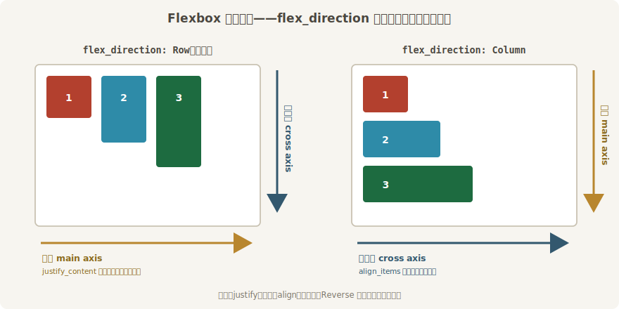
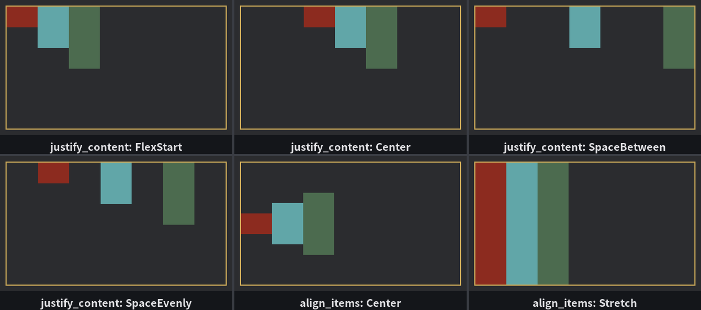
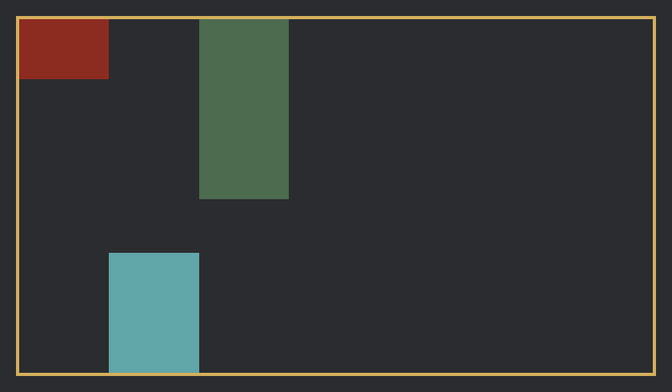

# 九宫对齐板

一个节点有了尺寸和皮，接下来是布局真正的主业：**一个父节点，怎么排它的一群孩子**。`display` 字段的默认档 `Display::Flex` 用的是 Flexbox 算法，整套算法建立在一个心智模型上——**两根轴**：



<span class="caption">Figure 28-6：Flexbox 的两根轴——`flex_direction` 定主轴朝向，交叉轴永远与它垂直</span>

- **主轴**（main axis）——孩子们排队的方向，由 `flex_direction` 决定：`Row`（水平，默认）、`Column`（垂直），以及各自的倒放 `RowReverse`、`ColumnReverse`；
- **交叉轴**（cross axis）——与主轴垂直的那根。

所有对齐字段都是围着这两根轴说话的，最常用的两个：**`justify_content` 管主轴上怎么分空地，`align_items` 管交叉轴上怎么站**。这两个名字不好记，但只要记住“justify＝主轴、align＝交叉轴”，剩下的档位见一遍就懂。搭一块对齐板，把档位逐个拨过去：

```rust
{{#include ../../code/ch28-ui-layout/examples/listing-28-05.rs:dials}}
```

```rust
{{#include ../../code/ch28-ui-layout/examples/listing-28-05.rs:setup}}
```

<span class="caption">Listing 28-5：九宫对齐板——640×360 的金框空场，三块高矮不一的牌子归两个旋钮调度（examples/listing-28-05.rs）</span>

三块牌宽都是 90，高度给的是 `min_height` 而不是 `height`——这个选择是伏笔，一会儿拨到 `Stretch` 档就知道为什么。拨档系统平平无奇，`Single<&mut Node>` 拿到对齐板、直接改字段——布局字段跟任何组件字段一样，运行时改了下一次结算就生效：

```rust
{{#include ../../code/ch28-ui-layout/examples/listing-28-05.rs:turn}}
```

<span class="caption">Listing 28-5（续）：J、A、D 三个键各转一个旋钮（examples/listing-28-05.rs）</span>

```console
cargo run -p ch28-ui-layout --example listing-28-05
```

按空格报初始档，再按 J 拨一档：

```text
水牌师傅：对齐板立好了。J 拨主轴，A 拨交叉轴，D 换方向，S 单独站队。
  主轴 Row ｜ justify_content: FlexStart ｜ align_items: FlexStart
  主轴 Row ｜ justify_content: Center ｜ align_items: FlexStart
```

一路拨下去，六种主轴分法都过一遍眼：



<span class="caption">Figure 28-7：对齐板的六个档位——前四格拨 `justify_content` 的四种分法，后两格拨 `align_items` 的两种站法</span>

`justify_content` 的六档分成两组：

- **挤成一团**：`FlexStart` 全体贴主轴起点（默认方向下就是左端）、`Center` 居中抱团、`FlexEnd` 贴终点；
- **摊开空地**：`SpaceBetween` 首尾两件顶死两端、空地在中间均分；`SpaceEvenly` 所有缝隙（含两端）一样宽；`SpaceAround` 给每件左右各发半份空地——于是两端各半份、件与件之间凑成整份，端头的缝是中间的一半。

`align_items` 的四档里，前三档跟主轴那组同理（贴起点、居中、贴终点），特殊的是 **`Stretch`**：交叉轴方向上没写死尺寸的孩子，一律拉到跟父级内容区同高（同宽）。这就是刚才 `min_height` 的伏笔——若三块牌写的是 `height: px(60)`，尺寸已经钉死，`Stretch` 拉不动它们；写 `min_height` 只给下限，高度本身还是 `Auto`，`Stretch` 档一拨，三块牌齐齐撑到 360 高。**图纸上留了 `Auto` 的地方，才轮得到对齐规则做主**——这条原理下一节分地时还会反复现身。

再按 D 把主轴拨到 `RowReverse`：三块牌立刻掉头，从右端起排，牌 1 变成最右边那个。注意 `FlexStart` 指的是**主轴的起点**——主轴一倒放，起点跟着搬家。枚举里另有一组 `Start`/`End` 档位专治这种“跟着翻转”的晕：它们永远指几何上的左/上端，不理会 Reverse。日常用 `FlexStart`/`FlexEnd` 就够，做从右往左的界面（或跟 Reverse 方向纠缠）时想起有这组“铁打的方位”即可。

> 落单的档位：`AlignItems` 还有一档 `Baseline`（按文字基线对齐，混排大小字号时用）；`JustifyContent` 还有一档 `Stretch`（Flex 下形同 `FlexStart`，到 Grid 里才管轨道拉伸）；两个枚举都还有个 `Default` 档——“我不表态”，交给算法默认。对齐板上都试得出来，不占正文篇幅了。

## 拨一下：一个人另站

`align_items` 是父级发的统一号令，可总有元素要单独站：一排图标里唯独徽章要沉底，一列表单里唯独按钮要贴右。孩子自己的 **`align_self`** 字段就是这句“我另站”——它的档位跟 `align_items` 一一对应，只是把 `Default` 换成了默认档 `Auto`：“听父级的”。给二号牌配一个专属旋钮：

```rust
{{#include ../../code/ch28-ui-layout/examples/listing-28-05.rs:self_dial}}
```

<span class="caption">Listing 28-5（终）：S 键只拨二号牌的 `align_self`——号令是号令，个人是个人（examples/listing-28-05.rs）</span>

按两下 S，把二号牌拨到 `FlexEnd`：

```text
  二号牌 align_self 拨到 Center
  二号牌 align_self 拨到 FlexEnd
```



<span class="caption">Figure 28-8：`align_self: FlexEnd`——全队听 `align_items: FlexStart` 贴顶，二号牌一个人沉底</span>

一号三号纹丝不动（还听 `FlexStart` 的号令），二号牌独自沉到板底。再拨一档到 `Stretch`，它一个人拉满 360 高——`min_height` 的伏笔对个人档同样奏效。**主轴方向没有对应的“单独站”**：主轴的位置是排队排出来的，一个人挪窝全队都得跟着挪——`Node` 上那个 `justify_self` 字段对 Flex 成员**不起作用**（它是给 Grid 预备的：格子里的住户不排队，横轴单独站位不牵连别人）。想在主轴上单独腾挪，用 `margin: auto` 那手（28.7 见）。

还剩一个没露面的常用字段：`align_content`——多**行**之间怎么分空地。它只在换行之后才有戏，而换行是下一节的正题。
