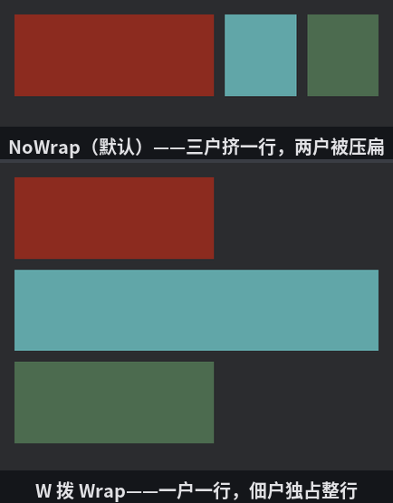

# 分地

上一节的牌子尺寸都是死的，对齐规则只是把它们搬来搬去。Flexbox 真正的看家本领是**弹性**：空间多了怎么分，不够了怎么摊。管这本账的是每个孩子身上的三个字段，名字都带 flex：

- **`flex_basis`**——底数：主轴方向上的起算尺寸。默认 `Auto`（退回去看 `width`/`height`）；
- **`flex_grow`**——分红权重：父级有**余粮**（内容区减去所有底数和缝隙后还剩空间）时，按各家 `grow` 值的比例分。默认 0.0——一分不要；
- **`flex_shrink`**——摊派权重：空间**亏空**时按比例收缩。默认 1.0——人人有份。

三户人家分一条街，权重各不相同：

```rust
{{#include ../../code/ch28-ui-layout/examples/listing-28-06.rs:setup}}
```

<span class="caption">Listing 28-6：三户分一条街——底数一律 220，老铺寸土不让，佃户拿一股，大户拿两股（examples/listing-28-06.rs）</span>

街面上还有个新面孔：**`column_gap`**——相邻孩子之间的公共缝隙，12 像素的巷子。它跟 margin 的区别在于归属：margin 是各家自留的边，gap 是**父级统一留的公地**，只出现在孩子**之间**（两端没有）。成排的元素用 gap 比逐个设 margin 干净得多。`row_gap` 管行与行之间——眼下只有一行，等会儿换行了就见到它。

```console
cargo run -p ch28-ui-layout --example listing-28-06
```

窗口 1280 宽。按空格报数（各户名号是 spawn 时写死的招牌，报的是当下实测宽度）：

```text
街面宽 1280——
  老铺 grow 0 shrink 0：220 逻辑像素（行心 y = 61）
  佃户 grow 1：408 逻辑像素（行心 y = 61）
  大户 grow 2：596 逻辑像素（行心 y = 61）
```

跟着账本对一遍算术。街面 border box 宽 1280，刨去 padding 32 剩内容区 1248；三户底数共 660，两条巷子 24；**余粮 = 1248 − 660 − 24 = 564**。按 grow 0 : 1 : 2 分成三股——老铺一股不要，佃户拿 188，大户拿 376。于是 220、220+188=408、220+376=596。报数分毫不差。

`grow` 的值不限于整数，也没有“总和须为 1”的规矩——它只是**权重**，各家的份额是自家值除以总和。写 0.5 : 1.0 和写 1 : 2 是同一个分法。

## 拨一下：四个连环实验

**G——大户退股**。把大户的 `flex_grow` 拨到 0：

```text
街面宽 1280——
  老铺 grow 0 shrink 0：220 逻辑像素（行心 y = 61）
  佃户 grow 1：784 逻辑像素（行心 y = 61）
  大户 grow 2：220 逻辑像素（行心 y = 61）
```

564 的余粮只剩佃户一家有权分——独吞，220+564=784。大户缩回底数。（招牌上还写着“grow 2”，那是名号；实际权重已经拨成 0。）

**拖窗——见亏空**。把窗口拽窄，街面只剩 434，内容区 402。三户底数加巷子要 684，**亏空 282**。这回轮到 `shrink` 记账——老铺 0，佃户、大户各 1，两家平摊 141：

```text
街面宽 434——
  老铺 grow 0 shrink 0：220 逻辑像素（行心 y = 61）
  佃户 grow 1：79 逻辑像素（行心 y = 61）
  大户 grow 2：78 逻辑像素（行心 y = 61）
```

老铺 `shrink: 0.0` 寸土不让，220 纹丝不动；佃户大户各被削到 79 和 78（差的 1 像素是舍入）。“这块最小宽度不能破”的元素——图标、头像、固定宽的按钮——`flex_shrink: 0.0` 就是它们的免摊金牌。（底数不同时，摊派严格说还会按底数加权——底大的多摊，CSS 的老规矩；三家同底，这儿显不出来。）

**S——老铺入伙**。把老铺的 `shrink` 拨回 1，三家平摊 282，各让 94：

```text
街面宽 434——
  老铺 grow 0 shrink 0：126 逻辑像素（行心 y = 61）
  佃户 grow 1：126 逻辑像素（行心 y = 61）
  大户 grow 2：126 逻辑像素（行心 y = 61）
```

**W——挤不下就换行**。收缩不是唯一的出路。`flex_wrap` 从默认的 `NoWrap` 拨到 `Wrap`，孩子们不再硬挤一行，放不下就开新行：

```text
街面宽 434——
  老铺 grow 0 shrink 0：220 逻辑像素（行心 y = 61）
  佃户 grow 1：402 逻辑像素（行心 y = 163）
  大户 grow 2：220 逻辑像素（行心 y = 265）
```

三个行心 y 各不相同了——一户一行。逐行看账：老铺 220 加巷子再加佃户底数 220 要 452，402 的街面装不下，佃户搬去第二行；它独占一行，`grow 1` 把整行 402 吃满；大户再起第三行，grow 已被拨成 0，缩在底数 220。行与行之间空的 12 像素，就是开场埋下的 `row_gap`。y 从 61 到 163 到 265，步长 102 = 行高 90 + row_gap 12，账账相符。



<span class="caption">Figure 28-9：同一条 434 宽的街——不许换行就收缩（上），许了就各起一行（下）</span>

换行之后，上一节末尾预告的 `align_content` 才有了用武之地：多行整体在交叉轴上怎么摆（贴顶、居中、行间摊空地），档位跟 `justify_content` 一个模子。板子上自己拨得出来，不再占篇幅。

最后补一句族谱：除了 `shrink: 0` 这张免摊金牌，`Node` 还备着 `min_width`/`max_width`/`min_height`/`max_height` 四把尺寸锁——尺寸本身留给弹性去弹，锁线兜住底和顶。上一节 `min_height` 配 `Stretch` 正是这个用法。

分地的规矩就这些：**底数打底，余粮按 grow 分，亏空按 shrink 摊，实在不行换行**。下一节看两类不进这本账的角色——出列的和离场的。
