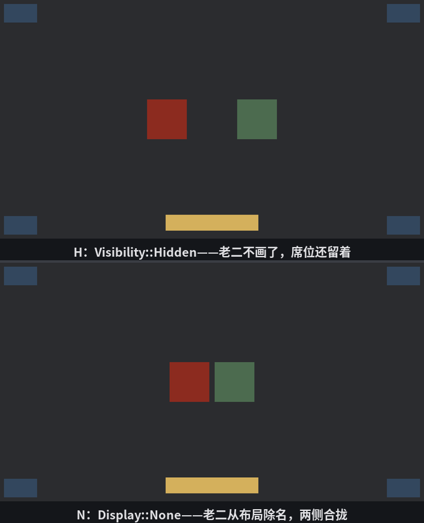

# 在场与离场

排队是常态，但界面上总有几类角色不排队：钉在角落的关闭按钮、盖在正中的弹窗、暂时收起来的面板。这一节讲三种“不在队里”的身份——出列的、隐身的、离场的——它们对布局的影响截然不同。

## 出列：绝对定位

`Node` 的 `position_type` 字段两档：默认 **`Relative`**——在队里，听父级布局调度；**`Absolute`**——出列，位置自己说了算。出列的节点**不占布局的地方**：兄弟们排队时当它不存在，它自个儿按四个方位字段（统称 **inset**：`left`、`top`、`right`、`bottom`）相对父级钉位置。钉的基准是父级的**边框内沿**（padding box）——衬边算在可钉的地界里，边框不算；父级没衬没框时，就是贴着父级边缘量。先给前厅四角各贴一张告示：

```rust
{{#include ../../code/ch28-ui-layout/examples/listing-28-07.rs:corners}}
```

<span class="caption">Listing 28-7：四角贴告示——每张用一对 inset 钉住一个角（examples/listing-28-07.rs）</span>

每张告示只钉**一对**边：入口钉 `left`+`top`，杂役钉 `right`+`bottom`，不管的边一律 `auto()`。`left: px(12)` 读作“我的左边缘离父级边框内沿 12 像素”，其余同理。

> inset 四字段在默认的 `Relative` 档下也收货，含义换成“从布局排定的位置**再挪**多少”——先照常落座占位，再朝反方向偏移。下一节的中场横幅就是用 `top: percent(42)` 把自己从贴顶的常规位置挪到中腰的。

场子中间是正常排队的三兄弟，外带一位出列的插班生——底部居中的金幅：

```rust
{{#include ../../code/ch28-ui-layout/examples/listing-28-07.rs:brothers}}
```

<span class="caption">Listing 28-7（续）：三兄弟排队占位；金幅是同一棵树上出列的第四个孩子，靠一手 `margin: auto` 居中（examples/listing-28-07.rs）</span>

金幅玩的是一套组合拳：

- `left: px(0)` + `right: px(0)`——可摆区拉满整个父级宽度；
- `width: px(280)`——但实际只要 280；
- `margin: UiRect::horizontal(auto())`——左右外距都写 `Auto`，多出来的空间被两侧外距**均分**，金幅正好居中。

这就是 28.3 预告的 `Auto` 绝活：在 margin 上，`Auto` 不是“归零”而是“能吃多少吃多少”。只写一侧 `auto()` 就是“推到另一头”——把元素顶到右端的经典写法。

> 留神一个哑巴坑：这套 auto 外距的戏法**只在挂进 Flex 容器时灵**。把金幅那坨组件原样搬出来当根节点 spawn，auto 会被当成 0，金幅贴死左缘——每个 UI 根节点外面都包着一层引擎的隐式包装节点，那层走的是 Grid 布局，而 Grid 结算绝对定位时不摊 auto 外距。想让出列的元素用 `margin: auto` 居中，先给它找个 Flex 爹——哪怕是一个铺满视口的空壳。

## 隐身与离场

出列的还在场上，接下来两位是真的“不见了”——但方式不同。老二身上备两个开关：

```rust
{{#include ../../code/ch28-ui-layout/examples/listing-28-07.rs:toggle}}
```

<span class="caption">Listing 28-7（续）：H 拨 `Visibility`，N 拨 `display`——两种“消失”（examples/listing-28-07.rs）</span>

```console
cargo run -p ch28-ui-layout --example listing-28-07
```

开场按空格报座次（报的是每人**中心点**的横坐标——`UiGlobalTransform` 记的是节点中心；报数顺序是 Query 的迭代序，不按大小个，场上一有变动它还可能重洗——别拿它当排序）：

```text
  老二 站在 x = 640
  老三 站在 x = 776
  老大 站在 x = 504
```

三人居中排开，老二正卡屏心 640。按 H 把老二的 `Visibility` 拨到 `Hidden`，再报：

```text
  老二 Visibility 拨到 Hidden
  老二 站在 x = 640
  老三 站在 x = 776
  老大 站在 x = 504
```

画面上老二没了，可**三个坐标一个没动**——人走了，席位还留着，中间空出一个人形的窟窿。`Visibility` 是第 12 章的老相识，它只管渲染这一头，布局账本照记不误。

按 H 请回老二，再按 N 把 `display` 拨到 `Display::None`：

```text
  老二 Display 拨到 None
  老三 站在 x = 708
  老大 站在 x = 572
  老二 站在 x = 0
```

这回不一样了：老大老三**当场合拢**，以两人的阵型重新居中（572 和 708）；老二报出个 x = 0——它被布局账本**除名**了，`ComputedNode` 和位置通通归零，渲染更是无从谈起。



<span class="caption">Figure 28-10：隐身与离场——`Hidden` 人走席留（上），`None` 连席位一起撤（下）</span>

两个开关各有用场，选错了界面会“跳”：

| | 还画吗 | 还占位吗 | 典型用途 |
|---|---|---|---|
| `Visibility::Hidden` | 否 | **占** | 闪烁提示、暂时遮住但不想让邻居挪窝 |
| `Display::None` | 否 | **不占** | 收起的面板、换页的选项卡——腾地方 |

`display` 还有第四档 `Display::Block`（传统文档流式的“一人一行”布局），界面开发里 Flex 和 Grid 基本包场，知道有它即可。

三兄弟的座次讲完了平面上的进退，下一节换个方向——垂直于玻璃往外看：谁贴在谁上面。
