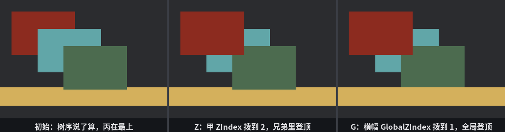

# 谁贴在上面

布局管的是平面上的横竖，玻璃却不止一层：告示摞着告示，弹窗盖着一切。UI 节点全都贴在同一块玻璃上，但**绘制有先后**——后画的盖住先画的。这一节把“谁后画”的规矩讲清。

先立三条默认规矩，不用写任何字段就在生效：

1. **孩子盖父级**——不然背景色会把内容糊住；
2. **弟弟盖哥哥**——同一父级下，spawn 得晚的兄弟画得晚；
3. **各树按根来**——多个根节点（多棵 UI 树）之间，也按同样的规则排。

要打破默认，有两枚旋钮。搭一面墙试它们：三张告示错位叠贴（是亲兄弟），另起一棵树横一条金幅：

```rust
{{#include ../../code/ch28-ui-layout/examples/listing-28-08.rs:setup}}
```

<span class="caption">Listing 28-8：三张告示一条横幅——告示们同根，横幅自立门户（examples/listing-28-08.rs）</span>

```rust
{{#include ../../code/ch28-ui-layout/examples/listing-28-08.rs:dials}}
```

<span class="caption">Listing 28-8（续）：Z 拨告示·甲的 `ZIndex`，G 拨横幅的 `GlobalZIndex`（examples/listing-28-08.rs）</span>

- **`ZIndex(i32)`**——`Node` 全家福里的常驻随从，默认 0。值大的画得晚（贴得上）；同值回退到 spawn 序。它的关键脾气是**只在亲兄弟之间比较**——出了这个父级，数字再大也没人理；
- **`GlobalZIndex(i32)`**——可选组件，挂上它的节点**脱离树序**，跟所有根节点一起进全局排序。横幅开场挂着 `GlobalZIndex(-1)`：比谁都小，垫在所有树后面。

想看引擎最终排出来的顺序，不用瞪眼数图层——资源 **`UiStack`** 就是排好的画序清单（`uinodes` 从垫底到封面），拿 `Name` 念出来：

```rust
{{#include ../../code/ch28-ui-layout/examples/listing-28-08.rs:stack}}
```

<span class="caption">Listing 28-8（再续）：空格念 `UiStack`——引擎的画序清单，从垫底到封面（examples/listing-28-08.rs）</span>

```console
cargo run -p ch28-ui-layout --example listing-28-08
```

```text
  垫底 → 中场横幅 → 告示·甲 → 告示·乙 → 告示·丙 → 封面
```

横幅垫底（−1 比墙的默认 0 小），三张告示按 spawn 序甲、乙、丙——丙最晚画，贴最上。画面上丙盖着乙、乙盖着甲。

**按 Z**，给告示·甲发 `ZIndex(2)`：

```text
  告示·甲 ZIndex 拨到 2
  垫底 → 中场横幅 → 告示·乙 → 告示·丙 → 告示·甲 → 封面
```

甲越过两个弟弟跳到兄弟堆顶——2 比乙丙的默认 0 大。注意它只在**兄弟内部**挪位，横幅（另一棵树）不参与这场排位。

**按 G**，横幅的 `GlobalZIndex` 从 −1 拨到 1：

```text
  中场横幅 GlobalZIndex 拨到 1
  垫底 → 告示·乙 → 告示·丙 → 告示·甲 → 中场横幅 → 封面
```

横幅一步登顶——**压过了 ZIndex(2) 的甲**。这是两枚旋钮辖区不同的铁证：甲的 2 是墙内部的家事，出了墙无效；横幅的全局 1 大过墙那棵树的全局 0（默认），整棵墙树连甲带丙全被它盖住。全局排序的完整规则是按 `(GlobalZIndex, ZIndex)` 复合排：全局值先比，平局再看局部值。



<span class="caption">Figure 28-11：三个时刻的叠放——默认树序（左）、ZIndex 兄弟内排位（中）、GlobalZIndex 全局登顶（右）</span>

实践口诀：**同级微调用 `ZIndex`，全场压轴用 `GlobalZIndex`**。弹窗、中场横幅这类“必须盖住一切”的角色，与其在树里调数字，不如自立一棵树、发一枚大额 `GlobalZIndex`——28.13 的《前厅》正是这么干的。

> 顺带记一笔：`UiStack` 这份清单不止管画序，第 25 章拾取判定 UI 命中时的先后、第 29 章交互焦点的分发，用的都是同一份账。

平面、进出、叠放都齐了，Flexbox 一家的本事讲完。下一节换一套布局算法——先画格线、后入座的 CSS Grid。
