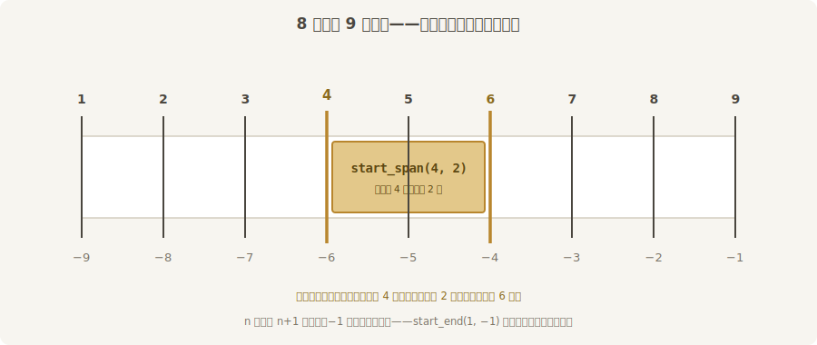
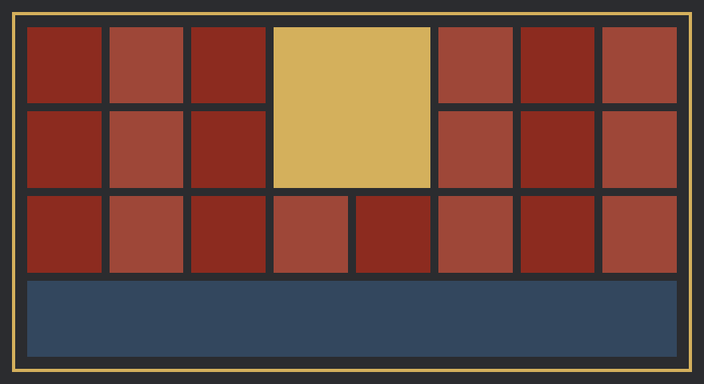
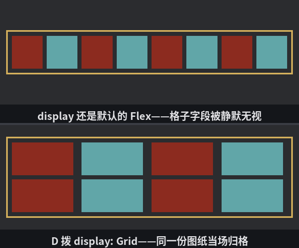

# 首演座位表

Flexbox 是排队的逻辑：孩子们一个接一个，排满了换行，每行各排各的。它天生是**一维**的——某一行里的元素跟上一行对不齐，也不需要对齐。可有些界面天生是**二维**的：库存格、技能栏、座位表——行与列都要横平竖直。这活儿归 `display` 的另一档：`Display::Grid`，CSS Grid 布局。

两套算法的分工一句话：**Flex 让内容自己排，Grid 先画地界后入座**。Grid 容器开工前先把整片地划成横竖格线，孩子再按格入座——格子在先，内容在后。

首演在即，给戏园画一张座位表：8 列 4 行，一间跨两行两列的包厢，一条横贯全场的乐池，二十张散座：

```rust
{{#include ../../code/ch28-ui-layout/examples/listing-28-09.rs:setup}}
```

<span class="caption">Listing 28-9：首演座位表——地界一次画完，住户按格入座（examples/listing-28-09.rs）</span>

字段分两拨：**容器**（座位表）画地界，**孩子**（座位）挑格子。

## 容器：画地界

- **`grid_template_columns` / `grid_template_rows`**——轨道清单：一条竖轨（列）和横轨（行）各多宽多高。轨道尺寸的类型是 `GridTrack`，量法比 `Val` 还多几种：`GridTrack::px(28.0)` 定死、`auto()` 看内容、以及 Grid 特有的 **`fr`（fraction，份）**——把刨去固定轨与缝隙后的剩余空间按份均分，`GridTrack::fr(1.0)` 一股，`fr(2.0)` 两股，跟 `flex_grow` 的分红一个道理。同规格的轨道懒得写八遍，用 **`RepeatedGridTrack`** 批发：`RepeatedGridTrack::flex(8, 1.0)` 就是“8 条轨、每条 1 份”。留意 `flex` 与 `fr` 差半档脾气：`flex` 轨允许缩到零，`fr` 轨会被内容撑住底、缩不过内容——座位表要的正是“格子尺寸全由容器说了算”，所以选 `flex`；
- **`row_gap` / `column_gap`**——老朋友，格子之间的过道；
- **`grid_auto_rows`**——伏笔：模板只画了 4 行，万一有住户挤不进去，补的**隐式行**按什么规格给。这儿写死 28 像素——一会儿的实验就靠它现形。

## 孩子：挑格子

孩子身上的 `grid_column`、`grid_row` 各是一份 **`GridPlacement`**——在这条轴上从哪条**格线**到哪条格线。注意说的是格线不是格子：8 列地有 **9 条竖格线**，从 1 数起；负数从末尾倒数，−1 是最后一条：



<span class="caption">Figure 28-12：格子与格线——n 列地有 n+1 条格线，正数从头数，负数从尾数</span>

三种住户三种写法：

- **包厢**：`GridPlacement::start_span(4, 2)`——从第 4 条格线起，跨 2 个格子。行方向同理；
- **乐池**：`grid_row: GridPlacement::start(4)` 钉死第 4 行；`grid_column: GridPlacement::start_end(1, -1)`——从第 1 条格线到**最后一条**，不管地有多少列都横贯到底。改天座位表扩成 12 列，这行代码一个字不用动；
- **散座**：什么都不写（`Node::default()`）。没指定位置的孩子按**自动放置**流入：从左到右、从上到下，跳过被占的格子，一人一格。

```console
cargo run -p ch28-ui-layout --example listing-28-09
```



<span class="caption">Figure 28-13：座位表——包厢与乐池按格线入座，二十张散座自动填空</span>

按空格报数：

```text
  包厢 157 × 161
  散座 74 × 77
```

对一遍账（都是逻辑像素，含舍入）：座位表 680×360，刨去 padding 24 与 border 6，内容区 650×330。竖向 8 条 fr 轨加 7 条 8 像素过道：每格宽 (650 − 56) ÷ 8 ≈ 74.3。散座一格 74；包厢两格带一条过道，74.3×2 + 8 ≈ 157。行高同理 (330 − 24) ÷ 4 = 76.5，包厢 76.5×2 + 8 = 161。**fr 轨道让格子随容器伸缩，格与格永远对齐**——这是 Flex 给不了的。

## 拨一下：包厢扩建

按 B 把包厢的跨度从 2×2 拨到 3×3：

```text
  包厢改成 3×3
  包厢 239 × 218
  散座 74 × 28
```

两件事同时发生了。**其一**，二十张散座全体重新入座——自动放置是每次布局重算的，包厢多占 5 格，散座就顺延 5 格，一行代码不用写。**其二**，账不对了：8×4 = 32 格，包厢 9 格、乐池 8 格，只剩 15 格，装不下 20 张散座——**挤出去的 5 张落进了隐式行**。报数里的散座 74×28 正是补行里那张：高度不是 fr 算出来的 76 而是 `grid_auto_rows` 写死的 28。包厢高 218 也对得上新账：多了一行一缝，剩余空间变少，fr 行缩到 67.5，67.5×3 + 16 ≈ 218。

再按 B 回 1×1：包厢缩成一格（74×76），散座又回 77 高——隐式行随住户清空自动消失。

> 没写 `grid_auto_rows` 时隐式轨道默认 `auto`（按内容给，空节点就是 0 高）。它还有三个同僚：`grid_auto_columns` 管补的列，`grid_auto_flow` 管自动放置是先行后列（默认 `Row`）还是先列后行（`Column`），用到再查。

## 格线从一数起

数组下标数惯了，手一滑就会写出“第 0 列”：

```rust
{{#include ../../code/ch28-ui-layout/examples/listing-28-10.rs:setup}}
```

<span class="caption">Listing 28-10：想放最左一列，顺手写了个 0——当场翻车（examples/listing-28-10.rs）</span>

```console
cargo run -p ch28-ui-layout --example listing-28-10
```

```text
thread 'Compute Task Pool (9)' (11240) panicked at C:\Users\94887\.cargo\registry\src\index.crates.io-1949cf8c6b5b557f\bevy_ui-0.19.0\src\ui_node.rs:2088:47:
Invalid start value of 0.: InvalidZeroIndex
note: run with `RUST_BACKTRACE=1` environment variable to display a backtrace
Encountered a panic in system `listing_28_10::setup`!
Encountered a panic in system `bevy_app::main_schedule::Main::run_main`!
```

`GridPlacement::start` 收的是 `i16`，0 既不是正着数也不是倒着数——运行期直接 panic，程序倒在 `setup` 里。记牢口诀：**格线 1 起步，负数从尾数，没有第 0 条**。`span(0)` 同罪（跨零个格子同样说不通）。这是运行期才炸的账——编译器拦不住一个合法的整数 0，测试时把每条 `GridPlacement` 都跑到才安心。

## 地契写了，衙门没换

比 panic 更阴的是下面这种。格子明明画了 4×2，跑起来八块牌挤成一排：

```rust
{{#include ../../code/ch28-ui-layout/examples/listing-28-11.rs:setup}}
```

<span class="caption">Listing 28-11：`grid_template` 配齐了，`display` 还是默认的 Flex——整套格子字段被静默无视（examples/listing-28-11.rs）</span>

病根在于**没写 `display: Display::Grid`**。布局算法是按 `display` 选的：Flex 算法根本不认识 `grid_template_columns` 这些字段——不读、不用、不警告、不报错，八个孩子被当成普通 flex 成员排成一排，还互相挤压。这是本章第二个哑巴坑：**格子字段全套配齐 ≠ Grid 生效，`display` 才是换衙门的那道手续**。

```console
cargo run -p ch28-ui-layout --example listing-28-11
```

按 D 补上这道手续：

```text
水牌师傅：格子明明画了 4×2，怎么全挤一排？——按 D 换衙门。
  display 拨到 Grid
```



<span class="caption">Figure 28-14：同一份格子图纸——`display` 没换时被静默无视（上），换成 Grid 立刻归格（下）</span>

八块牌应声归格。反过来的坑同样存在：`justify_content` 等 Flex 字段在 Grid 容器里也有自己的一套语义（Grid 借它管轨道整体的对齐），字段通用但含义微变——排查布局怪象时，第一眼先看 `display` 与字段是不是一家的。

座位表画完，前厅的骨架齐了。下一节给玻璃上图——`ImageNode` 进场。
