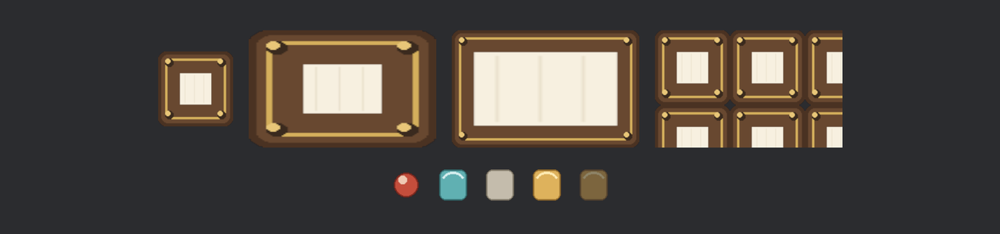

# 一张皮四种绷法

光有色块撑不起一面好看板——看板皮、图标、头像框，都得是图。玻璃上贴图归 **`ImageNode`**：它自带 `#[require(Node)]`，spawn 它一个就是一个完整的 UI 节点，图片列为内容。

水牌师傅的家当是一张 96×96 的九宫格看板皮（四边画着 28 像素宽的木框）和一条 48×48 四帧的小图标（球、上釉瓦、素瓦、金瓦）。同一张皮，四种绷法，一次排开：

```rust
{{#include ../../code/ch28-ui-layout/examples/listing-28-12.rs:setup}}
```

<span class="caption">Listing 28-12：一张皮四种绷法，一条图集五枚小签（examples/listing-28-12.rs）</span>

```console
cargo run -p ch28-ui-layout --example listing-28-12
```



<span class="caption">Figure 28-15：四种绷法（上排）与图集点帧（下排）——同一张皮、同一条图集</span>

绷法写在 `image_mode` 字段（类型 `NodeImageMode`），四档逐个看：

- **`Auto`（默认）**——图多大，节点便多大。第一块牌一个尺寸都没写，画出来正是 96×96：`ImageNode` 通过 required components 里那位 `ContentSize` 向布局系统报了体格——“我的内容天生这么大”。文本同理（下一节见）。这就是 28.1 全家福里 `ContentSize` 的职责：**让内容参与布局协商**。当然，你显式写了尺寸就听你的；
- **`Stretch`**——不跟布局商量，节点多大图就拉多大。240×150 的框把 96×96 的皮硬拉宽，四角的木框花纹肉眼可见地变了形——和第 15 章 `Sprite` 硬拉 `custom_size` 是同一种难看；
- **`Sliced(TextureSlicer)`**——九宫格。第 15 章学的那份说明书原样通用：`border: BorderRect::all(28.0)` 沿四边各 28 像素下裁线（跟画皮时的木框宽度对齐），四角保形、四边单向拉、中心双向拉。240×150 的看板四角木纹方方正正——15.4 节承诺的“这儿学会，那儿白送”就是这一刻；
- **`Tiled { tile_x, tile_y, stretch_value }`**——平铺：两个 bool 管横竖两个方向铺不铺，`stretch_value` 管铺之前先把原图放大多少倍（1.0 原大）。240×150 里铺出两列半的木框图案——适合可无限延展的纹理底。

## 图集与染色

下排五枚小签是第 15 章图集手艺的 UI 版，连类型都是同一个：`TextureAtlasLayout::from_grid` 切格子，`ImageNode::from_atlas_image` 收一份 `TextureAtlas`（layout 加 index）点帧。血条边的心形、技能栏的图标，一条图集喂全场。

第五枚金瓦多了一道 `.with_color(Color::srgba(1.0, 1.0, 1.0, 0.25))`——`color` 字段是**乘法染色**，跟 `Sprite::color` 同理：白色不动声色，带 alpha 的白让整枚图标褪成四分之一透明度。“还没挣到的成就”“冷却中的技能”，一个 color 就画出来，不用备第二张图。《前厅》的命图标和战利品架全靠这手。

> `ImageNode` 还有几个即开即用的小件：`flip_x`/`flip_y` 镜像翻面，`rect` 只取原图的一块矩形（不走图集也能裁），都是字段一填的事。

皮有了，最后一类内容是字——玻璃上的字怎么跟布局讨价还价，下一节见。
