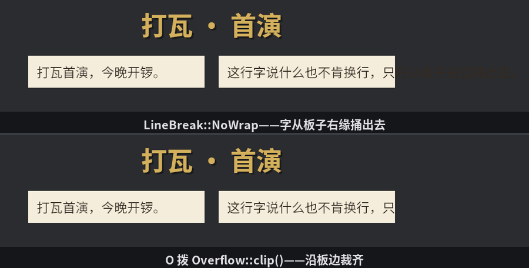

# 玻璃上的字

字是界面上最大的常客。玻璃上的文本组件 **`Text`** 在 16.11 已经露过脸——`Text2d` 的孪生兄弟，同一台 bevy_text 排版引擎的另一个出口，`TextFont`、`TextColor`、`TextLayout`、`TextSpan` 富文本那一套样式件原样通用。所以这一节不再讲字体与排版（那是第 16 章的地盘），只讲此处的新戏：**字和布局怎么合作**。

`Text` 自带 `#[require(Node)]`——它本身就是个 UI 节点，而字是一种“会自己量尺寸的内容”：几行字、多大字号，通过 `ContentSize` 向布局报体格，跟上一节 `Auto` 模式的图片同理。但字比图多一手：**宽度受限时它会折行，把身高重新报一遍**。挂两块字板对照：

```rust
{{#include ../../code/ch28-ui-layout/examples/listing-28-13.rs:setup}}
```

<span class="caption">Listing 28-13：匾额、会长高的左板、不肯换行的右板（examples/listing-28-13.rs）</span>

三处角色各有看点：

- **匾额**：孤零零一个 `Text`，不写任何尺寸——字多大节点多大。`TextShadow` 是 UI 文本专属的影子组件（`Text2d` 那边叫 `Text2dShadow`，16.11 的对照表列过），`offset` 往右下偏 3 像素、六成黑，描金大字立刻从玻璃上浮起来。不给 `offset` 时默认偏 (4, 4)；
- **左板**：`width: px(300)` 钉死宽，**高度不写**——由字说了算；
- **右板**：同样 300 宽，但字挂了 `TextLayout { linebreak: LineBreak::NoWrap, ..default() }`——16.8 的老相识，“说什么也不肯换行”。

```console
cargo run -p ch28-ui-layout --example listing-28-13
```

按空格报左板身高，再按两次 T 各续一句台词：

```text
  左板实测 300 × 54 逻辑像素
  台词续到 20 个字
  台词续到 30 个字
  左板实测 300 × 107 逻辑像素
```

改字的代码平平无奇——`text.push_str(...)` 往 `Text` 里续字符串。但一改，连锁反应全自动跑完：排版引擎重排文字，发现 300 宽装不下，折成三行；新身高经 `ContentSize` 报给布局；布局把板子从 54 拉到 107，padding 一分不少。**内容驱动布局**——做对话框、聊天气泡、任务描述，你只管改字，尺寸永远合身。

右板则是另一番景象：`NoWrap` 的字宽超过 300，节点装不下，字**原样捅出板外**——溢出内容默认是画出来的（`overflow` 默认 `Visible`）。按 O 给板子上裁刀：

```text
  右板 overflow 拨到 Overflow { x: Clip, y: Clip }
```



<span class="caption">Figure 28-16：不肯换行的字捅出板外（上）；`Overflow::clip()` 沿板边裁齐（下）</span>

`overflow` 字段横竖两轴各管各（`Overflow { x, y }`），每轴四档：`Visible`（默认，任它出去）、`Clip`（沿边裁掉）、`Hidden`（也裁，且内容不再把这块节点的最小尺寸撑大——节点能缩到比内容还小）、`Scroll`（裁掉且可以滚动——留给第 29 章）。`Overflow::clip()` 是两轴齐裁的便捷写法。裁剪对**整个子树**生效——被裁的不只是字，子节点、图片、一切越界的内容都沿边切断，做固定尺寸的窗口、列表视口全靠它。

> 一个只有对照着看才会发现的小差别：UI 文本的 required components 里有一位 `FontHinting`，默认**启用**——按像素网格微调字形轮廓，小字号更锐利；`Text2d` 默认不开（世界里的字要随镜头缩放，微调反而添乱）。平常感觉不到它，两边字形边缘略有不同时，来源在此。

字、图、布局全齐了。还剩最后一块拼图：这面玻璃到底贴在哪台相机前面？
