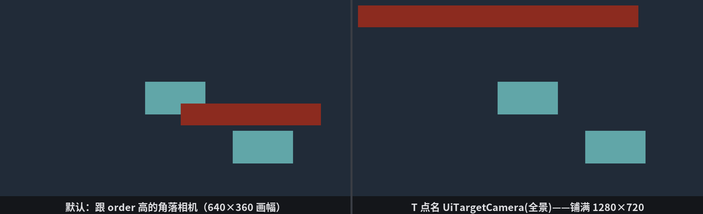

# 玻璃跟着哪台相机走

28.1 埋过一个雷：没有相机，UI 静默不画。这一节把雷排干净——玻璃到底是怎么找相机的。单相机时代无所谓“找”，场上只此一台；可第 13 章你已经会开小地图、分屏了，两台相机同场，玻璃贴谁镜头前？

这事有一套三层规则，从“不用管”到“点名到户”。先搭个能拨的场子——两台相机，一块占画幅八成宽的牌子：

```rust
{{#include ../../code/ch28-ui-layout/examples/listing-28-14.rs:setup}}
```

<span class="caption">Listing 28-14：全景相机铺满窗口（order 0），角落相机只占右下四分之一视口（order 1）（examples/listing-28-14.rs）</span>

两台都是第 13 章的寻常配置：全景相机清屏黛蓝铺满窗口；角落相机 `order: 1`（后画，盖在上层），`viewport` 只给右下四分之一。台上摆一块釉青色板作布景——它会在画面上亮相两次（全景一次、角落画幅里一次），角落相机的地盘就靠这第二次亮相来辨认。牌子宽 `percent(80)`——它归谁，一眼便知：画幅多宽，它就撑到八成。

报数系统里有位新面孔：required components 全家福里的 **`ComputedUiRenderTargetInfo`**——布局结算后“我这棵树参照的画布”的档案，`logical_size()` 报画幅的逻辑尺寸。

```console
cargo run -p ch28-ui-layout --example listing-28-14
```

开场按空格：

```text
  画幅 640 × 360 逻辑像素，牌子实测 512 × 80
```

**第一层：默认规则**。谁也没指派时，UI 跟**渲染到主窗口的相机里 `order` 最大**的那台——两台里角落相机 order 1 胜出。两个细节值得盯住：

- 画幅是 **640×360**，不是窗口的 1280×720——UI 的排版地界是相机的**视口**，不是窗口。角落相机只管右下四分之一，玻璃就只有四分之一大，牌子挤在那个角里（512 = 640 × 80%）。给小地图、后视镜配专属 UI，就是冲着这个特性来的。顺带一句：别指望给角落相机配一块自己的清屏底色来标记地盘——同一窗口上后画的相机，清屏色是不落地的（场子由先画的清，后来者只往上叠画），所以 Listing 28-14 靠色板亮相来辨界；
- “order 最大”这条默认规则很合理：order 大的画面盖在最上（第 13 章的规矩），UI 跟着最上层的画面走，多数时候正是你想要的。

**第二层：一枚官印**。默认规则不合意——比如就想让 UI 铺满全景——给全景相机盖上 marker 组件 **`IsDefaultUiCamera`**。按 I：

```text
  官印盖给全景相机——UI 应声搬回大画幅
  画幅 1280 × 720 逻辑像素，牌子实测 1024 × 80
```

官印一盖，order 谁大不再要紧。但这枚印**只能有一枚**——再按 I，两台都盖上：

```text
  两台相机都盖了官印——听引擎发落
WARN bevy_ui::ui_node: Two or more Entities with IsDefaultUiCamera found when only one Camera with this marker is allowed.
  画幅 640 × 360 逻辑像素，牌子实测 512 × 80
```

引擎骂了一句（这条警告走 `warn_once`，刷屏免了，但也意味着后续每帧都在犯同样的错而日志只此一条），然后**双印作废，回落到 order 规则**——画幅回到 640×360。第三下 I 收回全部官印，读数不变，此时是名正言顺的默认规则在当家。

**第三层：点名到户**。官印是全局的——一枚印管所有没被点名的 UI 树。想让**某一棵树**单独归某台相机，给它的**根节点**挂 **`UiTargetCamera(entity)`**。按 T 点名全景相机：

```text
  点名全景相机——官印、order 一概不看
  画幅 1280 × 720 逻辑像素，牌子实测 1024 × 80
```

点名压过一切默认。它只挂在根上，整棵树跟着走——这正是“比分牌归主画面、雷达标记归小地图”的写法：两棵树，各点各的名。再按 T 摘下，牌子回去听默认规则的。



<span class="caption">Figure 28-17：同一块 `percent(80)` 的牌子——跟角落相机时挤在四分之一画幅里（左），点名全景相机后铺满大画幅（右）；釉青色板的两次亮相标出了两块画幅各自的中心</span>

三层规则叠成一句话：**`UiTargetCamera` 点名最大，`IsDefaultUiCamera` 官印次之，都没有就跟 order 最大的主窗口相机**。回头看 28.1 的雷也通了：三层规则一层都兜不到相机时，节点无处可归，整棵树静默跳过。

> 深一层的玩法这里按下不表：把 UI 渲染进一张纹理再贴到世界里（3D 屏幕、告示牌），是第 35 章渲染目标的戏。

零件到此全部齐活。最后一节，把整章的家当装成《打瓦》公演的前厅。
