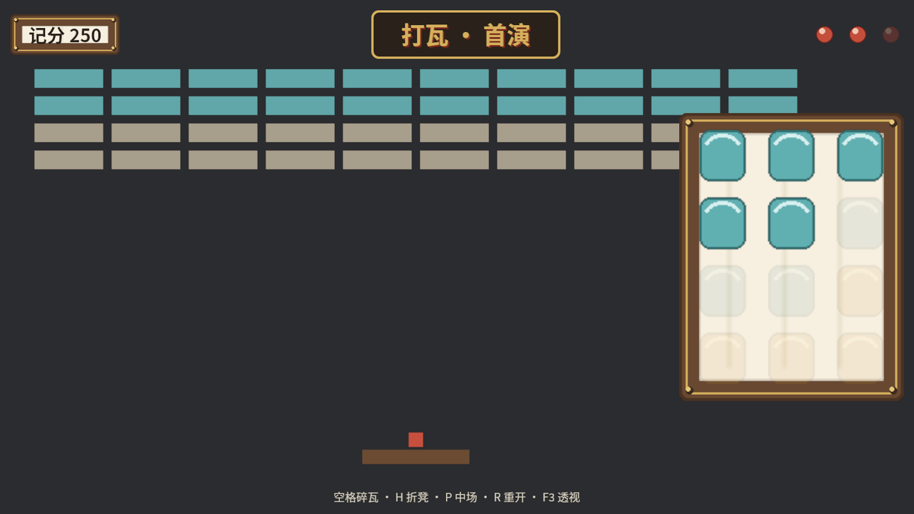
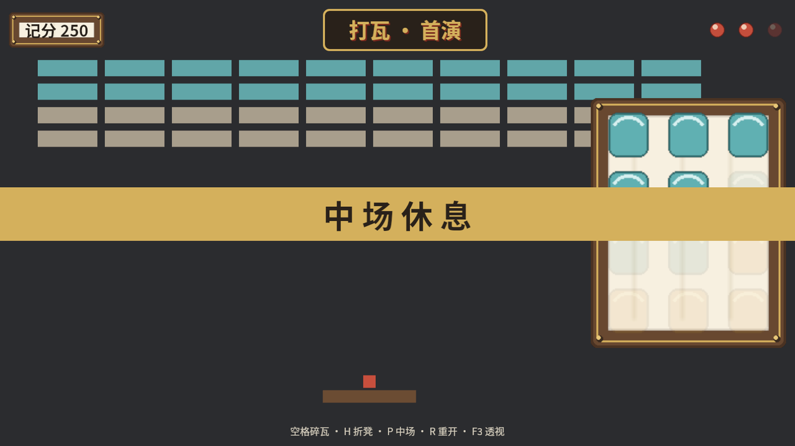
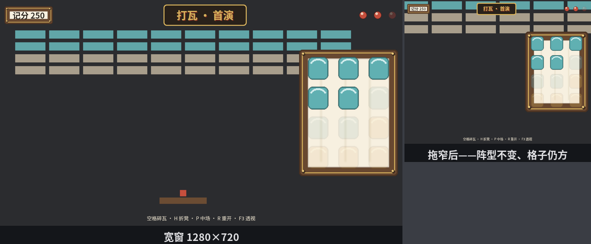

# 收场：《前厅》

《打瓦》要公演了。第 20 章那场戏有球有瓦有凳，唯独记分全靠终端打印——观众进了戏园，总不能让人家盯着控制台看比分。收场这一幕，把全章家当装配成一面正经的 HUD：顶栏比分牌、戏名匾额、三条命图标，右侧一面战利品架，底部提示条，外加一条随叫随到的中场横幅。全部尺寸走响应式——窗口拖成什么样，看板跟到什么样。

为了教学清楚，这里不搬第 20 章的玩法代码：台上摆一幕静态布景配一台缓摇的镜头，前台的账（比分、剩命）做成假账本资源，键盘拨着玩。骨架看清了，接回真游戏是第 29 章项目实战的事。

## 台上与玻璃

```rust
{{#include ../../code/ch28-ui-layout/src/main.rs:stage}}
```

<span class="caption">Listing 28-15：台上的布景——几排瓦、一条凳、一颗球，镜头缓缓左右摇（src/main.rs）</span>

台上是纯 sprite 世界：四排瓦、凳与球，`sway_camera` 让 `Camera2d` 每帧沿正弦缓摇。这台相机同时也是 UI 的默认跟班（场上唯一一台，三层规则兜底命中）——但接下来所有 UI 都会钉在玻璃上纹丝不动。跑起来最直观的就是这一层反差：**台上的瓦跟着镜头漂，玻璃上的字一动不动**——16.11 那句“镜头前的玻璃”，在这兑现成一整面看板。

## HUD 的骨架

```rust
{{#include ../../code/ch28-ui-layout/src/main.rs:hud_root}}
```

<span class="caption">Listing 28-15（续）：HUD 根与三棵树的分家（src/main.rs）</span>

界面分成**两棵 UI 树**，各司其职：

- **HUD 主树**：铺满视口的根（`percent(100)` 见方），`flex_direction: Column` 加 `justify_content: SpaceBetween`——顶栏推到天上、提示条压到地上，中间自然空出来给台面。四边 `padding: UiRect::all(vmin(2))`：窄边的 2%，屏幕越大衬边越宽，比例永远合眼。战利品架也挂在它名下，但走绝对定位出列，不占 Column 的队——28.7 说过的规矩：要用 auto 外距的戏法，就得挂进 Flex 容器，不能自立门户；
- **中场横幅**：独立的第二棵树，平时 `Display::None` 离场，`GlobalZIndex(2)` 保证一登场就盖过一切——28.7 与 28.8 的两手合用。

九宫格皮的说明书做成变量 `paneling` 复用——比分牌和战利品架共穿一张皮。

## 顶栏：三分天下

```rust
{{#include ../../code/ch28-ui-layout/src/main.rs:top_bar}}
```

<span class="caption">Listing 28-15（再续）：顶栏——`SpaceBetween` 把左中右撑开（src/main.rs）</span>

顶栏是一行 `SpaceBetween`：比分牌顶左、匾额居中、命图标顶右，窗口多宽都是这个阵型。三个成员各带一件本章兵器：

- **比分牌**：`ImageNode` 披九宫格皮，多了一手 `visual_box: VisualBox::BorderBox`——皮要画到**边框外沿**，整块牌都是木框底；默认档 `ContentBox` 只把皮铺在内容区，padding 那圈衬边是不铺的。字排在 `padding` 里，内衬用 `vw`/`vmin` 给——窗口一缩，衬边跟着收；
- **匾额**：`border_radius: BorderRadius::all(vmin(1.5))`——`Node` 的圆角字段，四角各给一份 `Val`（这儿统一 1.5% 窄边），墨底金框立刻不那么方头方脑。字号 `FontSize::Vw(2.6)`，16.7 的老朋友——窗宽的 2.6%，拖窗自己变；
- **命图标**：三枚 `vmin(5)` 见方的图集帧排一行——用 `VMin` 保证横竖屏下都是舒服的小方块。

## 战利品架：Grid 挂墙

```rust
{{#include ../../code/ch28-ui-layout/src/main.rs:loot_rack}}
```

<span class="caption">Listing 28-15（三续）：战利品架——绝对定位钉右缘，Grid 3×4 分格（src/main.rs）</span>

这块最考手艺，四件兵器一齐上：

- `position_type: Absolute` 加 `right: vmin(2)` 钉住右缘；
- `top: px(0)` + `bottom: px(0)` + `margin: UiRect::vertical(auto())`——28.7 横幅的居中戏法竖过来使：竖向可摆区拉满，上下外距 `auto` 均分，架子竖向正中；
- `height: percent(56)` 定高，宽度不写——交给 **`aspect_ratio: Some(0.78)`**：`Node` 的宽高比字段，宽 = 高 × 0.78。为什么 0.78？架子里是 3 列 4 行的格子，要想每格接近正方形，架子就该比 3:4（0.75）略宽一点——缝隙和衬边横向占三道、竖向占四道，0.78 正好找齐。窗口怎么拖，格子都不变形；
- `display: Grid`，3 列 4 行全 fr 轨——十二枚瓦签各占一格，`percent(100)` 撑满格子。

## 数据驱动玻璃

```rust
{{#include ../../code/ch28-ui-layout/src/main.rs:keys}}
```

```rust
{{#include ../../code/ch28-ui-layout/src/main.rs:refresh}}
```

<span class="caption">Listing 28-15（终）：键盘拨账本，账本驱动玻璃（src/main.rs）</span>

`FrontDesk` 是个普通资源：分数与剩命。按键系统只改账本，**不碰任何 UI**；`refresh_hud` 开头一句 `desk.is_changed()`（第 5 章的资源变更检测）——账没动就整个跳过，动了才重写玻璃：比分牌换字（`Text` 直接赋值）、命图标按序褪色、战利品架每 50 分点亮一枚（都是 28.10 的 `color` 染色，不换图）。**逻辑写账、玻璃读账**，两头互不认识——这就是 HUD 的标准分工，第 20 章的计分板换成这套，一行游戏逻辑都不用动。

## 开演

```console
cargo run -p ch28-ui-layout
```

```text
水牌师傅：前厅开张。空格碎瓦，H 折凳，P 中场，R 重开，F3 透视。
水牌师傅：又碎一片，记 50 分。
水牌师傅：又碎一片，记 100 分。
水牌师傅：折了条凳腿，还剩 2 条。
水牌师傅：重开锣。
```



<span class="caption">Figure 28-18：《前厅》开演——玻璃上比分、命数、战利品各就各位，台上的瓦阵在镜头里缓缓漂移</span>

按 P，中场横幅登场——`Display::None` 拨成 `Flex`，`GlobalZIndex(2)` 让它横贯一切之上：



<span class="caption">Figure 28-19：中场横幅——另起一棵树加一枚大额 `GlobalZIndex`，谁也压不住它</span>

最后验收“响应式”这个命题：把窗口拖小一圈。比分牌的衬边收窄、匾额的字跟着窗宽缩、命图标和战利品架按 `vmin`/`percent` 齐步换算，格子依旧方正，`SpaceBetween` 的阵型分毫不乱：



<span class="caption">Figure 28-20：拖窗验收——尺寸全走 `Vw`/`VMin`/百分比的 HUD，窄窗下阵型不散、比例不失</span>

没有一行代码监听窗口变化——**布局系统每帧结算，响应式是单位选对之后白来的**。

## 小结

- UI 的最小单元是 **`Node`**：意图写进字段，位置尺寸由布局系统每帧结算；结算结果读 **`ComputedNode`**（物理像素，`inverse_scale_factor()` 换算），布局跑在 `PostUpdate` 的 `UiSystems::Layout`，来早了读到零；
- 尺寸类型 **`Val`**：`Px` 定死、`Percent` 认爹、`Vw`/`Vh`/`VMin`/`VMax` 认天、`Auto` 交给算法；`UiScale` 只放大 `Px`。盒模型三层皮 `padding`/`border`/`margin`，`BoxSizing` 定量法（默认 BorderBox）；
- **Flexbox**（默认）管一维排队：`flex_direction` 定主轴，`justify_content`/`align_items` 管两轴分布；余粮按 `flex_grow` 分、亏空按 `flex_shrink` 摊、`flex_wrap` 换行。**Grid** 管二维格子：`grid_template_*` 画地界（fr 轨按份分），`GridPlacement` 按格线入座（1 起步、负数从尾数、0 当场 panic），没点名的自动流入；
- `position_type: Absolute` 出列不占位，inset 钉位置，`margin: auto` 居中；`Visibility::Hidden` 人走席留，`Display::None` 连席撤走；叠放同级看 `ZIndex`、全局看 `GlobalZIndex`，`UiStack` 是最终画序；
- 图走 **`ImageNode`**（Auto/Stretch/Sliced/Tiled 四种绷法，图集与染色照搬第 15 章），字走 **`Text`**（内容驱动尺寸，`Overflow` 管溢出）；玻璃跟相机的三层规则：点名 `UiTargetCamera` ＞ 官印 `IsDefaultUiCamera` ＞ order 最大——一台相机都没有就静默不画；
- 两个哑巴坑（无相机、`display` 忘换 Grid）加一个运行期 panic（格线写 0），都在本章亲眼看过。

## 练习

1. **加一块连击牌**：在顶栏比分牌和匾额之间加一块“连击 ×N”的小牌（九宫格皮、`Vw` 字号），空格连按时数字上涨、超过一秒不按就归零重挂——Flexbox 会自动把四件东西重新分布，观察 `SpaceBetween` 怎么处理第四个成员。
2. **战利品架搬家**：把架子改成 4 列 3 行的横版，钉在**底部居中**（提示条上方）。想想哪几个字段要动：`grid_template_*`、`aspect_ratio`、inset 与 `margin` 的组合。
3. **散场横幅**：命掉到 0 时自动弹一条“散 场”横幅（复用中场横幅的手法），按 R 重开时收场。注意驱动它的应该是 `refresh_hud` 一侧（读账本），不是按键一侧。
4. **给前厅装小地图**：从 Listing 28-14 搬来角落相机（order 1、右下四分之一视口），你会看到整面 HUD 立刻挤进小地图——用本章的哪件兵器让 HUD 留在全景画幅？（提示：一棵树一句话。）

前厅能看不能摸——按钮不会按下去，滑条拽不动，列表滚不了。玻璃怎么听手：第 29 章，UI 交互与控件。
